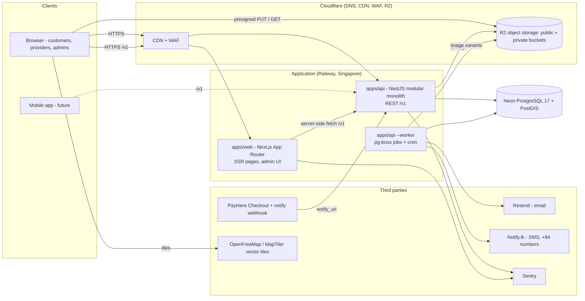
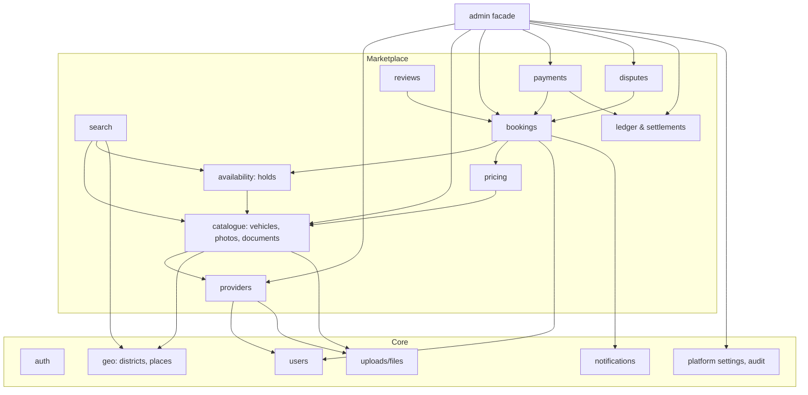
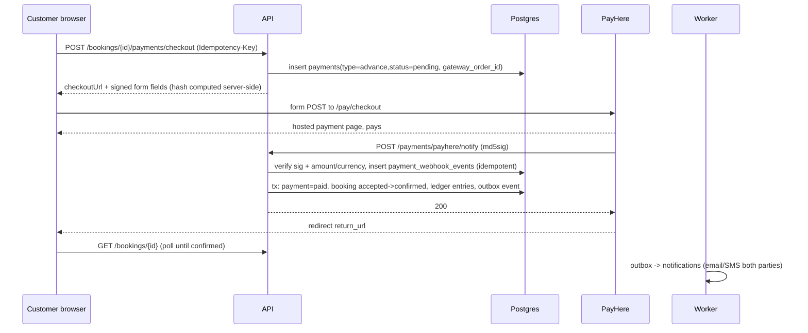
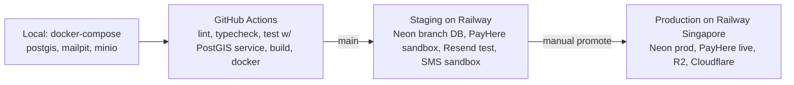

# Architecture

**Status:** Draft v0.1 for review (2026-10-02). Nothing is implemented; no packages are installed.
**Related:** [TECH_DECISIONS.md](TECH_DECISIONS.md) (why), [DATABASE_DESIGN.md](DATABASE_DESIGN.md), [API_DESIGN.md](API_DESIGN.md), [SECURITY_AND_PRIVACY.md](SECURITY_AND_PRIVACY.md), [ROADMAP.md](ROADMAP.md)

---

## 1. Architecture goals

| Goal                                                | How the architecture serves it                                                                                               |
| --------------------------------------------------- | ---------------------------------------------------------------------------------------------------------------------------- |
| Small team, fast iteration                          | One repository, one language (TypeScript) end to end, one database, no message broker, no Redis in MVP                       |
| Clear module boundaries now, services later if ever | **Modular monolith** backend with explicit module APIs; the web app never touches the database                               |
| Future mobile app                                   | All business capability behind a versioned REST API with a shared contract package; web is just the first client             |
| Low operational cost                                | Managed Postgres + two small containers + CDN/object storage; no per-map-load fees; most third-party usage inside free tiers |
| Trust and correctness                               | Booking integrity enforced in PostgreSQL; append-only audit trails; webhook idempotency                                      |
| Expandable geography and catalogue                  | Districts, places and categories are data, not code                                                                          |

---

## 2. High-level architecture



Key properties:

- **Two deployable units** (web, api) plus the api image run a second time in worker mode. No separate services per domain.
- The browser talks to the API directly for interactive calls (search, booking actions) and the Next.js server fetches the API during server rendering (public SEO pages). Both go through the same `/v1` contract.
- Files go **directly** between the browser and object storage via presigned URLs; the API only authorises and records.
- Map tiles come from a tile CDN; the API never proxies map traffic.

---

## 3. Repository layout (monorepo)

```
/
├─ apps/
│  ├─ web/                 # Next.js 16, App Router, TypeScript, Tailwind v4, shadcn/ui
│  └─ api/                 # NestJS 12 modular monolith: src/main.ts (HTTP) + src/worker.ts (pg-boss worker)
├─ packages/
│  ├─ contracts/           # Zod schemas + inferred types for every /api/v1 request/response
│  ├─ database/            # Drizzle schema, SQL migrations (drizzle/), seeds, database client
│  ├─ eslint-config/       # shared ESLint flat configs (base, nest, next)
│  └─ typescript-config/   # shared strict tsconfig bases (base, node, nestjs, nextjs)
├─ infra/
│  ├─ docker-compose.yml   # postgres 17 + postgis 3.5 (Phase 1); mailpit/minio added when email/uploads arrive
│  └─ db/init/             # creates the separate test database on first start
├─ .github/workflows/ci.yml # install, lint, build, typecheck, migrate+seed, test, format check
├─ docs/                   # this documentation
├─ CLAUDE.md, README.md
├─ package.json            # pnpm workspaces + turborepo pipelines (dev, build, lint, typecheck, test)
└─ pnpm-workspace.yaml, turbo.json, .env.example
```

(As implemented in Phase 1, 2026-10-03. Dockerfiles and hosting definitions arrive with the first deployment phase.)

Tooling: **pnpm** workspaces, **Turborepo** for task orchestration/caching, **TypeScript 6 strict**, **ESLint 9 + Prettier**, **Vitest** (unit/integration/e2e via supertest) and **Playwright** (browser e2e, later), **GitHub Actions** CI. Internal packages compile to CommonJS `dist/` (consumed by both Nest and Next) so no cross-package transpilation configuration is needed.

---

## 4. Frontend architecture (`apps/web`)

| Concern         | Decision                                                                                                                                                                                                                                                                   |
| --------------- | -------------------------------------------------------------------------------------------------------------------------------------------------------------------------------------------------------------------------------------------------------------------------- |
| Framework       | Next.js 15+, App Router, React Server Components for public pages; client components for interactive search/map/booking                                                                                                                                                    |
| Styling         | Tailwind CSS + shadcn/ui (Radix primitives) — accessible components without a design-system build-out                                                                                                                                                                      |
| Data fetching   | Server components fetch `/v1` with the typed client from `packages/contracts`; client-side mutations/queries via TanStack Query with the same client                                                                                                                       |
| Auth on the web | Access token held in memory (React context) and refreshed via the httpOnly refresh cookie; server components receive the cookie and call `/v1/auth/refresh` through a tiny route handler proxy only when needed; admin routes protected by middleware checking role claims |
| Routing         | Route groups: `(public)` home/search/vehicle/provider/town pages; `(account)` customer bookings/profile; `(provider)` dashboard; `(admin)` admin console. Admin is part of the same app behind RBAC to avoid a third deployable                                            |
| Maps            | MapLibre GL JS with vector tiles (OpenFreeMap style, MapTiler fallback). Components: `SearchMap` (pins + clustering + "search this area"), `LocationPicker` (provider pin), `StaticPin` (vehicle page approximate circle)                                                  |
| Geolocation     | Browser `navigator.geolocation` on explicit user action only ("Use my location"), never on page load                                                                                                                                                                       |
| i18n            | `next-intl` with English in MVP; message catalogues structured for Sinhala and Tamil                                                                                                                                                                                       |
| Forms           | react-hook-form + the shared Zod schemas, so client validation equals server validation                                                                                                                                                                                    |
| SEO             | SSR/ISR town and category landing pages (`/rent/[place]/[category]`), structured data (`Product`, `Offer`, `AggregateRating`), sitemap. Search results pages are SSR for the first page, client-side thereafter                                                            |
| Images          | `next/image` with the R2 public domain allow-listed; variants pre-generated by the worker (thumb 400w, medium 1000w, large 1600w, WebP)                                                                                                                                    |
| Analytics       | Privacy-respecting product analytics (PostHog or Plausible, free tiers); events for the funnel: search → view → request → accepted → paid                                                                                                                                  |
| Error reporting | Sentry browser SDK with PII scrubbing                                                                                                                                                                                                                                      |
| Accessibility   | WCAG 2.1 AA targets for core flows; keyboard-operable map alternatives (list view is always available)                                                                                                                                                                     |

Mobile-readiness: everything the web app does is through `/v1`; no business logic lives in Next.js route handlers (the only handlers are the refresh-cookie proxy and health).

---

## 5. Backend architecture (`apps/api`)

### 5.1 Modular monolith



Rules that keep the monolith modular:

1. Each module exposes a **service interface** (e.g. `AvailabilityService.createHold(tx, …)`) and its own repository; other modules call services, never another module's tables directly.
2. Cross-module writes that must be atomic (accept booking = booking update + hold insert + auto-decline) run inside one transaction passed explicitly (`tx` parameter), owned by the orchestrating module (`bookings`).
3. **Domain events** (`BookingAccepted`, `PaymentReceived`, `DocumentExpiring`) are emitted in-process after commit (transactional outbox pattern via a `domain_events` row written in the same transaction and dispatched by the worker). Notifications, metrics and analytics subscribe to events instead of being called inline. This keeps `bookings` free of knowledge about SMS templates and makes extraction possible later.
4. The `admin` module is a facade over other modules' services with extra authorisation and audit; it has no tables of its own except `admin_audit_logs`.
5. Lint rule (eslint `import/no-restricted-paths`) enforces that `modules/x` may import only from `modules/x`, `shared`, and the public `index.ts` of the modules it is allowed to depend on.

### 5.2 Request pipeline (NestJS)

`Helmet` → CORS → request-id (`x-request-id`, accepted or generated, echoed on the response) → rate limiter (`@nestjs/throttler`) → JWT guard (optional per route) → role guard → Zod validation pipe (`ZodValidationPipe(schema)` applied per route with schemas from `packages/contracts`) → controller → service → repository (Drizzle) → response DTO mapper → global exception filter (uniform `ApiError` envelope) → pino logger (nestjs-pino, PII redaction, pretty output in development).

Routes are mounted under the global prefix and URI version: `/api/v1/...`. OpenAPI generation from the Zod contracts is deferred to Phase 2 (see TECH_DECISIONS D18).

### 5.3 Data access

- **Drizzle ORM** over `postgres.js`; schema in TypeScript mirrors DATABASE_DESIGN.md; migrations are SQL files generated by `drizzle-kit` and hand-edited for PostGIS, exclusion constraints and partial indexes.
- PostGIS queries written as typed `sql` fragments inside repositories (`ST_DWithin`, `ST_Distance`, range overlap) — see DATABASE_DESIGN §7.4.
- Transactions: `db.transaction(async (tx) => …)`; repositories accept `tx` so services compose atomically.
- Optimistic locking helper for `version` columns; exclusion-violation (`23P01`) mapped to `409 BOOKING_CONFLICT`.

### 5.4 Background jobs (worker)

- **pg-boss** (Postgres-backed queue) runs in the same codebase, started with `node dist/main.js --worker`. No Redis.
- Job types: `outbox.dispatch` (domain events → handlers), `notify.send` (per channel with retries/backoff), `image.process` (sharp variants + EXIF strip), `booking.expire-requests`, `booking.expire-unpaid`, `booking.reminders`, `documents.expiry`, `provider.metrics`, `cleanup.*`, `settlements.generate` (admin-triggered).
- Cron via pg-boss schedules (`*/1 * * * *` for expiries). Jobs are idempotent and keyed (`singletonKey`) to avoid duplicates when two worker instances run.
- Transactional enqueue: jobs that must follow a DB write are enqueued inside the same transaction (pg-boss supports this through the shared connection), so a committed booking always has its notification job.

### 5.5 Pricing engine

Pure, deterministic module: `quote(vehicle, window, options, settings) → PriceBreakdown`. Unit-tested exhaustively (day counting across 24-hour boundaries, weekly/monthly thresholds, driver fee, delivery fee, rounding to LKR cents, advance/balance split, commission). Signed `quoteToken` (HMAC, 15 min) binds the breakdown to the inputs so `POST /bookings` can verify the customer saw the stored price.

### 5.6 Booking state machine

Transitions are defined in one table-driven definition (`from`, `to`, `allowedActors`, `guard`, `effects`), used by the service, by `allowedActions` in responses, and by tests. See USER_FLOWS §0 for the diagram.

---

## 6. Database architecture

- **PostgreSQL 17 with PostGIS** on a managed provider (Neon, Singapore region recommended; Supabase Postgres as alternative — both ship PostGIS). One database, one schema, migrations in repo.
- Why PostGIS (not plain lat/lng maths, not Mongo geo, not Elasticsearch): we need "vehicles within R km of a point that are free in [S,E)" as a single indexed query joined with availability and filters; PostGIS `geography` + GiST gives correct great-circle distances and bounding-box queries with no extra infrastructure, and our data is relational and transactional (bookings, money). A separate search engine would add cost and consistency problems for availability. Details in TECH_DECISIONS.
- Availability integrity: `vehicle_holds` + `EXCLUDE USING gist` (DATABASE_DESIGN §7). This is the single most important correctness guarantee in the system and is **not** replicable in application code alone.
- Connection pooling: Neon's pooled endpoint (PgBouncer) for the API; direct endpoint for migrations and pg-boss (which needs session features).
- Backups: provider daily backups + point-in-time restore (Neon history retention / Supabase PITR add-on); restore drill in Phase 10.
- Local development: `infra/docker-compose.yml` runs `postgis/postgis:17` with the same extensions.

---

## 7. Authentication and authorization

Summarised here; full detail in SECURITY_AND_PRIVACY.md §2–3.

- Custom auth module in the API: email+password (Argon2id), phone OTP (SMS) and email OTP; JWT access tokens (15 min, ES256) + rotating opaque refresh tokens stored hashed with family-based reuse detection.
- Web: refresh token in httpOnly cookie scoped to the auth path; access token in memory.
- Roles in token claims (`customer`, `provider`, `admin`, `super_admin`); ownership checks in services.
- Admin: mandatory second factor (email OTP in MVP, TOTP later), 8-hour sessions.
- Why custom and not Auth.js/Clerk/Supabase Auth: the API, not the web app, is the identity authority (mobile clients later); Sri Lankan phone-OTP-first flows need control over SMS routing and limits; third-party auth SaaS adds cost and lock-in. Google OAuth is added later as an identity provider under the same session model.

---

## 8. File storage

- **Cloudflare R2** (S3-compatible) with two buckets: `public` (vehicle photos, avatars, logos) behind a Cloudflare custom domain/CDN; `private` (identity documents, vehicle documents, dispute attachments) with no public access.
- Upload flow: `POST /uploads/presign` → browser `PUT` to R2 → `POST /uploads/{id}/complete` → worker job validates (magic bytes, size), re-encodes images, writes variants, updates `file_objects`.
- Private reads: API issues short-lived (≤2 min) presigned GET URLs to authorised users; every issuance is logged.
- Local dev: MinIO via docker-compose with the same S3 client.
- Why R2 over Cloudinary/S3: zero egress fees (photo-heavy pages), free tier covers MVP volumes, S3 API keeps us portable; image transforms done once at upload instead of per request. Cloudinary remains a documented alternative if transformation needs grow.

---

## 9. Maps and geolocation

| Need                                                     | MVP implementation                                                                                                                            | Cost                       |
| -------------------------------------------------------- | --------------------------------------------------------------------------------------------------------------------------------------------- | -------------------------- |
| Customer current location                                | Browser Geolocation API on user action                                                                                                        | 0                          |
| Search by town/area                                      | Curated `places` gazetteer in Postgres (seeded for launch region + major towns), prefix/alias suggest                                         | 0                          |
| Map display (results, vehicle page, provider pin picker) | MapLibre GL JS + OpenFreeMap vector tiles (donation-supported, no key); MapTiler Cloud (Flex, ~USD 30/mo) or Stadia as paid fallback with SLA | 0 (fallback ~USD 20–30/mo) |
| Provider location                                        | Provider drops/drags a pin on the map; optional "use my location"; stored as `geography(Point)`                                               | 0                          |
| Distance                                                 | PostGIS `ST_Distance`/`ST_DWithin` (great-circle). Not road distance; shown as "~2.3 km away"                                                 | 0                          |
| Delivery address                                         | Free text + optional pin on map                                                                                                               | 0                          |
| Address/POI autocomplete (hotel names)                   | **Not in MVP.** Later: Geoapify (free 3k req/day, commercial OK) or self-hosted Photon on the OSM Sri Lanka extract                           | 0–59/mo                    |
| Road routing / ETA                                       | Not in MVP; later OSRM self-host on the 137 MB Sri Lanka OSM extract if needed                                                                | 0                          |

Why not Google Maps Platform in MVP: the March 2025 pricing gives 10,000 free Dynamic Map loads per SKU per month and then USD 7 per 1,000; more importantly, Google's terms forbid using Places/Geocoding results with a non-Google map, so it is an all-or-nothing choice. Our MVP needs (town search in a 5-town region, pins, distance) are fully met by a gazetteer + MapLibre at zero cost and no key-leak/billing risk. If hotel-name search for tourists proves necessary, the documented upgrade path is either Geoapify/Photon (keeps MapLibre) or a wholesale switch to Google (Maps JS + Places Autocomplete with session tokens). See TECH_DECISIONS §D6.

---

## 10. Payments



MVP payment model (recommended, see TECH_DECISIONS §D8 for alternatives):

- **Online now:** a booking advance equal to the platform commission (default 10% of the rental total), paid via PayHere Checkout. The platform is merchant of record for this amount only.
- **At pickup, to the provider:** remaining balance (90%) and the refundable security deposit, by cash/card/transfer as the provider accepts; recorded in the app.
- **Consequence:** the platform never holds provider money → no payouts, no settlement runs, no money-transfer licensing questions in MVP. The `ledger_entries`/`settlements` tables exist (dormant) so that raising `advance_percentage` above `commission_rate` later turns on settlements without schema changes.
- PayHere facts that shaped this: no split/third-party payouts; card holds limited to 7 days and credit cards only; Lite plan caps (LKR 50,000 per payment, 200,000 per month) → plan upgrade to Plus (LKR 3,990/month, 2.99%) expected within months; non-card methods (Genie, eZ Cash, Frimi…) cannot be refunded via PayHere → refunds for those are manual bank transfers; settlement T+2.
- Gateway abstraction: `PaymentGateway` interface (`createCheckout`, `verifyWebhook`, `fetchPayment`, `refund`) with a `PayHereGateway` implementation; Genie Business (2.75%) or OnePay are drop-in candidates later.
- Currency: all charges in LKR (CBSL requires LKR between residents); the UI shows indicative USD/EUR for tourists using a daily-cached rate, clearly labelled.
- Later: PayHere Authorize/Capture for deposits on short rentals, Preapproval tokens for re-authorisation, API refunds, full online payment with scheduled CEFTS payouts.

---

## 11. Notifications

- **Channels (MVP):** in-app (DB-backed feed), email (Resend; free tier 3,000/month), SMS to Sri Lankan numbers (Notify.lk or Text.lk, ~LKR 0.6–0.8/SMS; alphanumeric sender ID registered early — ~3-week lead time).
- **Tourists with foreign numbers:** email + in-app in MVP; international SMS via a global CPaaS is a later add-on (cost per destination).
- **WhatsApp:** `wa.me` click-to-chat links after confirmation (no API). WhatsApp Cloud API utility templates (~USD 0.002 per message for Sri Lanka from Oct 2026, subject to verification) are the Phase 11 upgrade once Meta business verification is done.
- **Design:** `notifications` row is the source of truth; `notification_deliveries` per channel with retries; templates versioned in code (MJML/React Email for email, plain text for SMS); user preferences later. All sends happen in the worker, never in request handlers.
- **OTP delivery** uses the same SMS/email adapters with a separate, higher-priority queue.

---

## 12. Logging, monitoring, alerting

| Area    | MVP                                                                                                                                                                                                                                          |
| ------- | -------------------------------------------------------------------------------------------------------------------------------------------------------------------------------------------------------------------------------------------- |
| Logs    | pino JSON logs (API + worker + Next server) → Railway log drain → Better Stack (free tier) or Axiom; 90-day retention; PII redaction at source                                                                                               |
| Errors  | Sentry (free tier) for API, worker and browser; release tagging from CI                                                                                                                                                                      |
| Metrics | `/health` (liveness), `/ready` (DB + storage reachability); key business counters as structured log events (bookings created/accepted/paid, webhook failures, exclusion violations) with log-based alerts; Prometheus/OpenTelemetry deferred |
| Uptime  | External HTTP monitor (Better Stack / UptimeRobot) on web, API and webhook endpoint                                                                                                                                                          |
| Alerts  | Webhook signature failures, job failure rate, 5xx rate, SMS budget threshold, OTP rate-limit storms, DB CPU/storage thresholds from the provider                                                                                             |
| Audit   | `booking_events`, `admin_audit_logs`, `payment_webhook_events` (DATABASE_DESIGN)                                                                                                                                                             |

---

## 13. Environments and deployment



- **Local:** `pnpm db:setup` starts PostGIS in Docker, migrates and seeds (districts, places, categories, settings; demo providers/vehicles come with Phase 4); `pnpm dev` runs web + api, `pnpm dev:worker` the worker. Only PostgreSQL runs in Docker during Phase 1; Mailpit (email) and MinIO (S3) are added when Phases 2 and 3 need them. PayHere sandbox credentials go in `.env` from Phase 7. See README.md for the full local workflow.
- **CI:** every PR runs lint, typecheck, unit + integration tests (Postgres+PostGIS service container, migrations applied), e2e smoke (Playwright against a built app), dependency audit, secret scan; builds Docker images for api and web.
- **Staging:** auto-deploys from `main`; uses a Neon branch (cheap, disposable) and sandbox credentials; QA runs the booking happy path end to end including a PayHere sandbox payment.
- **Production:** manual promotion; migrations run as a release step before the new containers start (expand/contract pattern for breaking schema changes); zero-downtime rolling deploy on Railway.
- **Secrets:** Railway environment variables (per environment); no secrets in the repo; rotation runbook in Phase 10.
- **Hosting choice and cost (see TECH_DECISIONS §D10):** Railway (Singapore) for web/api/worker ≈ USD 15–25/month at MVP load; Neon pay-as-you-go ≈ USD 5–20; Cloudflare R2 ≈ 0 within free tier; Resend/Sentry/Better Stack free tiers; Notify.lk SMS ≈ LKR 0.6/SMS; PayHere 3.3% (Lite) → 2.99% + LKR 3,990/month (Plus). **Total ≈ USD 25–50/month** before SMS and gateway fees. Alternative: one DigitalOcean droplet in Bangalore (USD 12–24) with Coolify running everything, if the team prefers a VPS.
- **Region:** Singapore (Railway, Neon). Mumbai is marginally closer to Sri Lanka but has fewer provider options; Cloudflare's Colombo point of presence serves static assets and tiles with low latency either way.

---

## 14. Scaling strategy (in order; none needed for launch)

1. **Vertical**: bigger Railway service / Neon compute; Postgres handles tens of thousands of listings and bookings on a small instance.
2. **Caching**: HTTP caching for public vehicle/provider pages (ISR), 30-second cache for identical search queries, CDN caching of tiles/images (already in place).
3. **Horizontal API**: run 2+ API instances (stateless; rate limiter moves to Redis/Upstash at that point); worker already separate.
4. **Database**: read replica for search/reporting; `search_logs`/analytics moved to a warehouse or dropped to logs.
5. **Extraction candidates** (only if a module's load or team ownership justifies it): notifications (already event-driven), search (if full-text/ranking needs Elastic/Meilisearch), images. Module boundaries and the outbox make these extractions mechanical.
6. **Mobile app**: React Native/Expo consuming `/v1` with the same contracts package; push notifications via `device_tokens` + FCM/APNs.
7. **Geography**: adding districts/places is data; no architectural change for island-wide coverage.

---

## 15. What is deliberately not in the architecture (MVP)

Microservices, Kubernetes, Redis, Kafka/RabbitMQ, Elasticsearch, GraphQL, real-time WebSocket chat, Google Maps Platform, Firebase, serverless functions as the primary runtime, a separate admin application, an escrow/payout engine, automated KYC vendors (Didit-style liveness), vehicle GPS trackers, dynamic pricing. Each has a documented trigger for reconsideration in TECH_DECISIONS.md.
