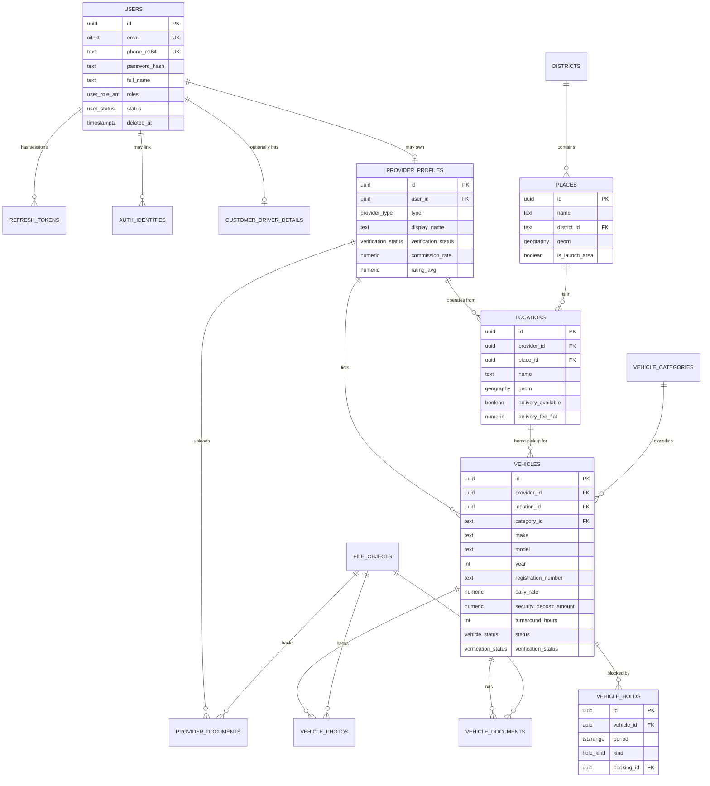
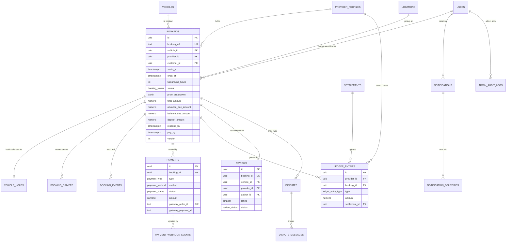

# Database Design

**Status:** Draft v0.1 for review (planning phase, 2026-10-02). No migrations exist yet.
**Related:** [ARCHITECTURE.md](ARCHITECTURE.md), [API_DESIGN.md](API_DESIGN.md), [SECURITY_AND_PRIVACY.md](SECURITY_AND_PRIVACY.md), [TECH_DECISIONS.md](TECH_DECISIONS.md)

---

## 1. Goals and design principles

1. **Never double-book a vehicle.** Availability must be enforced by the database, not only by application code.
2. **Transparent, reproducible pricing.** Every booking stores an immutable price breakdown snapshot. Changing a vehicle's price later never changes an existing booking.
3. **Trust is data.** Verification status, document expiry, and booking history are first-class, queryable facts.
4. **Geography is native.** Locations are `geography(Point, 4326)` columns with GiST indexes so "nearby" is a cheap indexed query.
5. **Data minimisation.** Sensitive personal data (NIC, passport, driving licence, bank accounts) is stored encrypted, only where needed, with explicit retention rules. See [SECURITY_AND_PRIVACY.md](SECURITY_AND_PRIVACY.md).
6. **Auditability.** State changes on bookings, payments, verifications and admin actions are append-only event rows.
7. **Boring and portable.** Plain PostgreSQL features (constraints, ranges, enums, partial indexes). No vendor-specific extensions beyond PostGIS and `btree_gist`.
8. **Expandable.** New vehicle categories, new districts/regions, new pricing rules, and multi-user provider teams are additive changes, not rewrites.

## 2. Engine, extensions, conventions

| Item               | Decision                                                                                                                                                                                                                                                                                                                                                                                                                                                                                                                                                                                                                                                                                                                                                                                                                                                                              |
| ------------------ | ------------------------------------------------------------------------------------------------------------------------------------------------------------------------------------------------------------------------------------------------------------------------------------------------------------------------------------------------------------------------------------------------------------------------------------------------------------------------------------------------------------------------------------------------------------------------------------------------------------------------------------------------------------------------------------------------------------------------------------------------------------------------------------------------------------------------------------------------------------------------------------- |
| Engine             | PostgreSQL 16+ (17 preferred)                                                                                                                                                                                                                                                                                                                                                                                                                                                                                                                                                                                                                                                                                                                                                                                                                                                         |
| Extensions         | `postgis` (geography types + GiST), `btree_gist` (needed for exclusion constraints mixing `=` and `&&`), `citext` (case-insensitive email), `pgcrypto` (available; app-level encryption is preferred, see §10)                                                                                                                                                                                                                                                                                                                                                                                                                                                                                                                                                                                                                                                                        |
| Primary keys       | `uuid`, generated application-side as **UUIDv7** (time-ordered, index-friendly). DB default `gen_random_uuid()` as fallback.                                                                                                                                                                                                                                                                                                                                                                                                                                                                                                                                                                                                                                                                                                                                                          |
| Timestamps         | Always `timestamptz`, stored in UTC. Sri Lanka is UTC+05:30 with no DST; the API renders times in `Asia/Colombo` for vehicle-side events.                                                                                                                                                                                                                                                                                                                                                                                                                                                                                                                                                                                                                                                                                                                                             |
| Money              | `numeric(12,2)` plus a `currency char(3)` column (ISO 4217). Base currency is `LKR`. Never floats.                                                                                                                                                                                                                                                                                                                                                                                                                                                                                                                                                                                                                                                                                                                                                                                    |
| Naming             | `snake_case` tables (plural) and columns. FK columns end in `_id`. Boolean columns start with `is_` / `has_`.                                                                                                                                                                                                                                                                                                                                                                                                                                                                                                                                                                                                                                                                                                                                                                         |
| Audit columns      | `created_at`, `updated_at` on every mutable table (trigger-maintained `updated_at`). `created_by` / `updated_by` where a human actor matters.                                                                                                                                                                                                                                                                                                                                                                                                                                                                                                                                                                                                                                                                                                                                         |
| Soft delete        | `deleted_at timestamptz NULL` on user-facing content (vehicles, locations, photos, reviews, documents). **Never** on bookings, payments, ledger, events, audit logs. Unique indexes on soft-deletable tables are partial (`WHERE deleted_at IS NULL`).                                                                                                                                                                                                                                                                                                                                                                                                                                                                                                                                                                                                                                |
| Enums              | PostgreSQL `enum` types for closed, rarely changing sets (statuses). Lookup tables for sets that admins will extend (vehicle categories, places).                                                                                                                                                                                                                                                                                                                                                                                                                                                                                                                                                                                                                                                                                                                                     |
| Optimistic locking | `version integer NOT NULL DEFAULT 1` on `bookings` and `vehicles`.                                                                                                                                                                                                                                                                                                                                                                                                                                                                                                                                                                                                                                                                                                                                                                                                                    |
| Schema management  | SQL migrations committed to `packages/database/drizzle/` (generated by drizzle-kit, hand-edited where needed). **drizzle-kit quotes column types it does not recognise, including PostGIS `geography(Point,4326)`; the quotes must be removed by hand** (a test in `packages/database` fails if a quoted PostGIS type is committed). Extensions, trigger functions, triggers and (later) exclusion constraints live in custom migrations (`drizzle-kit generate --custom`). The migration runner takes a PostgreSQL advisory lock so concurrent starters never race. Forward-only: undo with a new migration.                                                                                                                                                                                                                                                                         |
| Phase 1 status     | Implemented 2026-10-03: extensions, `set_updated_at()` trigger function, `districts`, `places` (GiST index), `vehicle_categories`, `platform_settings`, triggers, and idempotent seeds. Reference tables use database-generated UUIDs (`gen_random_uuid()`); application-generated UUIDv7 starts with the high-volume tables in Phase 2+.                                                                                                                                                                                                                                                                                                                                                                                                                                                                                                                                             |
| Phase 2 status     | Implemented 2026-10-03 (migrations `0003_auth`, `0004_users_updated_at_trigger`): enums `user_role`, `user_status`, `one_time_token_purpose`; tables `users`, `refresh_tokens`, `one_time_tokens` with application-generated UUIDv7 ids (`packages/database/src/ids.ts`). Deviations from §6.1, all deliberate for the lean scope: `users.email` and `password_hash` are NOT NULL until phone-first/OAuth accounts exist; `users.phone_e164` has no unique index while phones are unverified; `users.sessions_revoked_at` was added (immediate access-token invalidation); `avatar_file_id` waits for `file_objects`. `otp_codes` is implemented as `one_time_tokens` (e-mail link tokens; a `channel` column is added with SMS). `auth_identities`, `customer_driver_details`, `notifications`, `notification_deliveries`, `file_objects` are deferred to the phases that need them. |

## 3. Entity overview

Grouped by module (module boundaries mirror the backend architecture):

| Module           | Tables                                                                  |
| ---------------- | ----------------------------------------------------------------------- |
| Identity & auth  | `users`, `auth_identities`, `refresh_tokens`, `otp_codes`               |
| Customer         | `customer_driver_details`                                               |
| Provider         | `provider_profiles`, `provider_documents`, `provider_members` (future)  |
| Geography        | `districts`, `places`, `locations`                                      |
| Catalogue        | `vehicle_categories`, `vehicles`, `vehicle_photos`, `vehicle_documents` |
| Availability     | `vehicle_holds`                                                         |
| Booking          | `bookings`, `booking_drivers`, `booking_events`                         |
| Payments & money | `payments`, `payment_webhook_events`, `ledger_entries`, `settlements`   |
| Trust            | `reviews`, `disputes`, `dispute_messages`                               |
| Notifications    | `notifications`, `notification_deliveries`                              |
| Files            | `file_objects`                                                          |
| Platform         | `platform_settings`, `admin_audit_logs`                                 |

## 4. ERD

### 4.1 Core marketplace entities



### 4.2 Booking, payment and trust entities



## 5. Enum types

```sql
CREATE TYPE user_role AS ENUM ('customer', 'provider', 'admin', 'super_admin');
CREATE TYPE user_status AS ENUM ('active', 'suspended', 'deleted');
CREATE TYPE otp_channel AS ENUM ('sms', 'email');
CREATE TYPE otp_purpose AS ENUM ('verify_phone', 'verify_email', 'login', 'password_reset', 'change_phone');
CREATE TYPE provider_type AS ENUM ('individual', 'business');
CREATE TYPE verification_status AS ENUM ('unverified', 'pending_review', 'verified', 'rejected', 'suspended');
CREATE TYPE document_status AS ENUM ('pending_review', 'approved', 'rejected', 'expired');
CREATE TYPE provider_document_type AS ENUM ('nic_front', 'nic_back', 'passport', 'driving_licence', 'business_registration', 'proof_of_address', 'other');
CREATE TYPE vehicle_document_type AS ENUM ('certificate_of_registration', 'revenue_licence', 'insurance_certificate', 'emission_test', 'other');
CREATE TYPE transmission AS ENUM ('manual', 'automatic');
CREATE TYPE fuel_type AS ENUM ('petrol', 'diesel', 'hybrid', 'electric');
CREATE TYPE rental_mode_offer AS ENUM ('self_drive', 'with_driver', 'both');
CREATE TYPE rental_mode AS ENUM ('self_drive', 'with_driver');
CREATE TYPE vehicle_status AS ENUM ('draft', 'pending_review', 'active', 'paused', 'rejected', 'archived');
CREATE TYPE pickup_type AS ENUM ('at_location', 'delivery');
CREATE TYPE hold_kind AS ENUM ('booking', 'block');
CREATE TYPE block_reason AS ENUM ('maintenance', 'personal_use', 'external_booking', 'other');
CREATE TYPE booking_status AS ENUM (
  'requested', 'accepted', 'confirmed', 'active', 'completed',
  'declined', 'expired', 'cancelled_by_customer', 'cancelled_by_provider', 'no_show'
);
CREATE TYPE actor_type AS ENUM ('customer', 'provider', 'admin', 'system');
CREATE TYPE payment_type AS ENUM ('advance', 'balance', 'security_deposit', 'deposit_refund', 'extra_charges', 'refund');
CREATE TYPE payment_method AS ENUM ('payhere', 'cash', 'bank_transfer', 'card_in_person');
CREATE TYPE payment_status AS ENUM ('pending', 'paid', 'failed', 'cancelled', 'refunded', 'partially_refunded');
CREATE TYPE ledger_entry_type AS ENUM ('advance_collected', 'platform_commission', 'refund_issued', 'payout', 'adjustment');
CREATE TYPE settlement_status AS ENUM ('draft', 'approved', 'paid');
CREATE TYPE review_status AS ENUM ('published', 'hidden', 'flagged');
CREATE TYPE notification_channel AS ENUM ('in_app', 'email', 'sms', 'whatsapp', 'push');
CREATE TYPE delivery_status AS ENUM ('queued', 'sent', 'delivered', 'failed');
CREATE TYPE dispute_type AS ENUM ('damage', 'deposit', 'no_show', 'pricing', 'behaviour', 'other');
CREATE TYPE dispute_status AS ENUM ('open', 'under_review', 'resolved', 'rejected');
CREATE TYPE file_visibility AS ENUM ('public', 'private');
```

## 6. Table definitions

Column notation: `name type [constraints] — meaning`. All tables have `created_at timestamptz NOT NULL DEFAULT now()` and `updated_at timestamptz NOT NULL DEFAULT now()` unless marked append-only.

### 6.1 Identity & auth

#### `users`

One row per person. A user may be a customer, a provider owner, an admin, or several at once (`roles` array).

| Column             | Type                                                | Notes                                                  |
| ------------------ | --------------------------------------------------- | ------------------------------------------------------ |
| id                 | uuid PK                                             |                                                        |
| email              | citext NULL, UNIQUE (partial, `deleted_at IS NULL`) | Required for tourists; optional for phone-first locals |
| email_verified_at  | timestamptz NULL                                    |                                                        |
| phone_e164         | text NULL, UNIQUE (partial)                         | E.164, e.g. `+9477xxxxxxx`. Required for providers.    |
| phone_verified_at  | timestamptz NULL                                    |                                                        |
| password_hash      | text NULL                                           | Argon2id. NULL when OAuth-only or OTP-only             |
| full_name          | text NOT NULL                                       |                                                        |
| avatar_file_id     | uuid NULL FK → file_objects                         |                                                        |
| roles              | user_role[] NOT NULL DEFAULT '{customer}'           |                                                        |
| status             | user_status NOT NULL DEFAULT 'active'               |                                                        |
| preferred_language | text NOT NULL DEFAULT 'en'                          | `en`, `si`, `ta`                                       |
| preferred_currency | char(3) NOT NULL DEFAULT 'LKR'                      | Display currency only                                  |
| country_code       | char(2) NULL                                        | Residence; informs tourist/local UX                    |
| last_login_at      | timestamptz NULL                                    |                                                        |
| terms_accepted_at  | timestamptz NULL                                    | Version in `terms_version`                             |
| terms_version      | text NULL                                           |                                                        |
| deleted_at         | timestamptz NULL                                    | Anonymised on deletion (see §9)                        |

**Check:** `email IS NOT NULL OR phone_e164 IS NOT NULL`.
**Indexes:** unique partials on `email`, `phone_e164`; GIN on `roles` (admin listing).

#### `auth_identities` (future: Google / Apple sign-in)

| Column           | Type                     |
| ---------------- | ------------------------ |
| id               | uuid PK                  |
| user_id          | uuid FK → users          |
| provider         | text (`google`, `apple`) |
| provider_subject | text                     |
| email_at_link    | citext NULL              |

**Unique:** `(provider, provider_subject)`.

#### `refresh_tokens`

Server-side session records enabling rotation, revocation and reuse detection.

| Column         | Type                          | Notes                                                              |
| -------------- | ----------------------------- | ------------------------------------------------------------------ |
| id             | uuid PK                       |                                                                    |
| user_id        | uuid FK → users               |                                                                    |
| token_hash     | text UNIQUE                   | SHA-256 of the opaque token; raw token never stored                |
| family_id      | uuid NOT NULL                 | Rotation family; reuse of a revoked token revokes the whole family |
| replaced_by_id | uuid NULL FK → refresh_tokens |                                                                    |
| client         | text                          | `web`, `ios`, `android`                                            |
| user_agent     | text NULL                     |                                                                    |
| ip             | inet NULL                     |                                                                    |
| expires_at     | timestamptz NOT NULL          |                                                                    |
| revoked_at     | timestamptz NULL              |                                                                    |
| last_used_at   | timestamptz NULL              |                                                                    |

**Indexes:** `(user_id)`, `(family_id)`, `(expires_at)` for cleanup.

#### `otp_codes`

| Column      | Type                 | Notes                                           |
| ----------- | -------------------- | ----------------------------------------------- |
| id          | uuid PK              |                                                 |
| user_id     | uuid NULL FK → users | NULL during pre-registration phone verification |
| channel     | otp_channel          |                                                 |
| destination | text                 | phone or email                                  |
| purpose     | otp_purpose          |                                                 |
| code_hash   | text                 | HMAC-SHA256 of 6-digit code                     |
| expires_at  | timestamptz          | 5–10 minutes                                    |
| consumed_at | timestamptz NULL     |                                                 |
| attempts    | smallint DEFAULT 0   | Max 5                                           |
| request_ip  | inet NULL            |                                                 |

**Indexes:** `(destination, purpose, created_at DESC)` for rate limiting; append-only, purged after 24h.

### 6.2 Customer

#### `customer_driver_details`

Optional reusable driver information. Stored only if the customer opts to save it; otherwise entered per booking into `booking_drivers`.

| Column              | Type                        | Notes                                   |
| ------------------- | --------------------------- | --------------------------------------- |
| user_id             | uuid PK FK → users          | 1:1                                     |
| licence_number_enc  | bytea                       | App-level AES-256-GCM                   |
| licence_number_hash | text                        | HMAC for duplicate detection only       |
| licence_country     | char(2)                     |                                         |
| licence_expires_on  | date                        |                                         |
| licence_class       | text NULL                   |                                         |
| idp_number_enc      | bytea NULL                  | International Driving Permit (tourists) |
| id_doc_type         | text                        | `nic` / `passport`                      |
| id_doc_number_enc   | bytea                       |                                         |
| date_of_birth       | date NULL                   | Only if minimum-age rules require it    |
| licence_file_id     | uuid NULL FK → file_objects | Private bucket; optional in MVP         |
| verified_at         | timestamptz NULL            | Future: admin/automated verification    |

### 6.3 Provider

#### `provider_profiles`

| Column                    | Type                                     | Notes                                  |
| ------------------------- | ---------------------------------------- | -------------------------------------- |
| id                        | uuid PK                                  |                                        |
| user_id                   | uuid UNIQUE FK → users                   | Owner account                          |
| type                      | provider_type                            | individual / business                  |
| display_name              | text NOT NULL                            | Public name                            |
| slug                      | text UNIQUE                              | Public URL                             |
| legal_name                | text NULL                                | Required for business                  |
| business_registration_no  | text NULL                                |                                        |
| description               | text NULL                                |                                        |
| public_phone_e164         | text NULL                                | Revealed only post-confirmation        |
| whatsapp_e164             | text NULL                                | Used for `wa.me` deep link             |
| public_email              | citext NULL                              |                                        |
| logo_file_id              | uuid NULL FK → file_objects              |                                        |
| verification_status       | verification_status DEFAULT 'unverified' |                                        |
| verification_submitted_at | timestamptz NULL                         |                                        |
| verified_at               | timestamptz NULL                         |                                        |
| verified_by               | uuid NULL FK → users                     | admin                                  |
| rejection_reason          | text NULL                                |                                        |
| commission_rate           | numeric(5,2) NULL                        | Override of platform default (percent) |
| bank_name                 | text NULL                                | For manual settlements                 |
| bank_branch               | text NULL                                |                                        |
| bank_account_name         | text NULL                                |                                        |
| bank_account_number_enc   | bytea NULL                               | Encrypted                              |
| rating_avg                | numeric(3,2) NULL                        | Denormalised from reviews              |
| rating_count              | integer DEFAULT 0                        |                                        |
| completed_bookings_count  | integer DEFAULT 0                        |                                        |
| acceptance_rate           | numeric(5,2) NULL                        | Rolling 90 days, job-computed          |
| avg_response_minutes      | integer NULL                             |                                        |
| deleted_at                | timestamptz NULL                         |                                        |

#### `provider_documents`

| Column           | Type                                     |
| ---------------- | ---------------------------------------- |
| id               | uuid PK                                  |
| provider_id      | uuid FK → provider_profiles              |
| type             | provider_document_type                   |
| file_id          | uuid FK → file_objects (private)         |
| status           | document_status DEFAULT 'pending_review' |
| expires_on       | date NULL                                |
| reviewed_by      | uuid NULL FK → users                     |
| reviewed_at      | timestamptz NULL                         |
| rejection_reason | text NULL                                |
| deleted_at       | timestamptz NULL                         |

**Indexes:** `(provider_id)`, `(status)`, `(expires_on) WHERE status = 'approved'`.

#### `provider_members` (future, not MVP)

`provider_id`, `user_id`, `role` (`owner`, `manager`, `staff`), `invited_at`, `accepted_at`. MVP has exactly one owner per provider.

### 6.4 Geography

#### `districts`

Reference table of Sri Lanka's 25 districts, with an `is_active` service-area flag used for phased rollout.

| Column     | Type                          |
| ---------- | ----------------------------- |
| id         | text PK (slug, e.g. `matara`) |
| name       | text                          |
| province   | text                          |
| is_active  | boolean DEFAULT false         |
| sort_order | smallint                      |

#### `places`

Curated gazetteer of towns, areas and landmarks used for search-box suggestions and for grouping. Seeded for the launch region first (Matara, Weligama, Mirissa, Galle, Unawatuna, plus surrounding towns), then expanded.

| Column            | Type                    | Notes                                         |
| ----------------- | ----------------------- | --------------------------------------------- |
| id                | uuid PK                 |                                               |
| slug              | text UNIQUE             | `mirissa`                                     |
| name              | text                    | English                                       |
| name_si           | text NULL               | Sinhala                                       |
| name_ta           | text NULL               | Tamil                                         |
| aliases           | text[]                  | Alternative spellings                         |
| kind              | text                    | `city`, `town`, `area`, `landmark`, `airport` |
| district_id       | text FK → districts     |                                               |
| parent_id         | uuid NULL FK → places   | e.g. Unawatuna → Galle                        |
| geom              | geography(Point,4326)   | Centre point                                  |
| default_radius_km | numeric(5,1) DEFAULT 15 | Search radius when this place is selected     |
| is_launch_area    | boolean DEFAULT false   |                                               |
| search_rank       | smallint DEFAULT 0      | Suggest ordering                              |
| is_active         | boolean DEFAULT true    |                                               |

**Indexes:** GiST on `geom`; GIN trigram on `name` (`pg_trgm`, optional) for prefix suggestions; `(district_id)`.

#### `locations`

A provider's physical pickup point (office, home, hotel desk). Vehicles are attached to one home location.

| Column              | Type                           | Notes                                  |
| ------------------- | ------------------------------ | -------------------------------------- |
| id                  | uuid PK                        |                                        |
| provider_id         | uuid FK → provider_profiles    |                                        |
| name                | text                           | "Mirissa office"                       |
| address_line1       | text                           |                                        |
| address_line2       | text NULL                      |                                        |
| place_id            | uuid NULL FK → places          | Nearest town/area (chosen by provider) |
| district_id         | text FK → districts            | Must be an active district at creation |
| geom                | geography(Point,4326) NOT NULL | Pin set by provider on map             |
| pickup_instructions | text NULL                      | Shown after confirmation               |
| opening_hours       | jsonb NULL                     | Future; MVP uses free text             |
| delivery_available  | boolean DEFAULT false          |                                        |
| delivery_radius_km  | numeric(5,1) NULL              |                                        |
| delivery_fee_flat   | numeric(12,2) NULL             | MVP: flat fee within radius            |
| delivery_fee_per_km | numeric(12,2) NULL             | Future                                 |
| is_primary          | boolean DEFAULT false          |                                        |
| is_active           | boolean DEFAULT true           |                                        |
| deleted_at          | timestamptz NULL               |                                        |

**Indexes:** GiST on `geom`; `(provider_id)`; `(district_id)`.

### 6.5 Catalogue

#### `vehicle_categories`

| Column                 | Type                                                          |
| ---------------------- | ------------------------------------------------------------- |
| id                     | text PK (`car`, `suv`, `van`, `bike`, `scooter`, `tuktuk`, …) |
| name                   | text                                                          |
| name_si / name_ta      | text NULL                                                     |
| icon                   | text NULL                                                     |
| sort_order             | smallint                                                      |
| requires_licence_class | text NULL (informational)                                     |
| is_active              | boolean DEFAULT true                                          |

Adding a category is an insert, not a migration.

#### `vehicles`

| Column                   | Type                                     | Notes                                                                                                  |
| ------------------------ | ---------------------------------------- | ------------------------------------------------------------------------------------------------------ |
| id                       | uuid PK                                  |                                                                                                        |
| provider_id              | uuid FK → provider_profiles              |                                                                                                        |
| location_id              | uuid FK → locations                      | Home pickup location                                                                                   |
| category_id              | text FK → vehicle_categories             |                                                                                                        |
| slug                     | text UNIQUE                              | SEO URL (`toyota-aqua-2018-mirissa-ab12`)                                                              |
| make                     | text                                     |                                                                                                        |
| model                    | text                                     |                                                                                                        |
| year                     | smallint                                 |                                                                                                        |
| registration_number      | text                                     | Stored plain (visible on the plate anyway); **never** rendered publicly; unique per provider (partial) |
| colour                   | text NULL                                |                                                                                                        |
| transmission             | transmission                             |                                                                                                        |
| fuel_type                | fuel_type                                |                                                                                                        |
| seats                    | smallint                                 |                                                                                                        |
| doors                    | smallint NULL                            |                                                                                                        |
| engine_cc                | smallint NULL                            | Bikes/scooters/tuk-tuks                                                                                |
| luggage_capacity         | smallint NULL                            | Bags                                                                                                   |
| features                 | text[] DEFAULT '{}'                      | `ac`, `bluetooth`, `usb`, `child_seat`, `roof_rack`, `helmets_included` …                              |
| description              | text NULL                                |                                                                                                        |
| rental_mode_offer        | rental_mode_offer                        | self-drive / with driver / both                                                                        |
| currency                 | char(3) DEFAULT 'LKR'                    |                                                                                                        |
| daily_rate               | numeric(12,2) NOT NULL                   | Self-drive base                                                                                        |
| weekly_rate              | numeric(12,2) NULL                       | Applied when days ≥ 7 (per-day equivalent computed)                                                    |
| monthly_rate             | numeric(12,2) NULL                       | Applied when days ≥ 28                                                                                 |
| driver_fee_per_day       | numeric(12,2) NULL                       | Required when with-driver offered                                                                      |
| security_deposit_amount  | numeric(12,2) NOT NULL DEFAULT 0         | Refundable; collected at pickup in MVP                                                                 |
| included_km_per_day      | integer NULL                             | NULL = unlimited                                                                                       |
| extra_km_rate            | numeric(12,2) NULL                       | Per km over allowance                                                                                  |
| min_rental_days          | smallint DEFAULT 1                       |                                                                                                        |
| max_rental_days          | smallint NULL                            |                                                                                                        |
| turnaround_hours         | smallint DEFAULT 2                       | Buffer added after each booking                                                                        |
| advance_notice_hours     | smallint DEFAULT 12                      | Earliest pickup from now                                                                               |
| instant_book             | boolean DEFAULT false                    | Future (Phase 11)                                                                                      |
| min_driver_age           | smallint NULL                            |                                                                                                        |
| status                   | vehicle_status DEFAULT 'draft'           | Listing lifecycle                                                                                      |
| verification_status      | verification_status DEFAULT 'unverified' | Document-based                                                                                         |
| verified_at              | timestamptz NULL                         |                                                                                                        |
| rejection_reason         | text NULL                                |                                                                                                        |
| primary_photo_id         | uuid NULL FK → vehicle_photos            |                                                                                                        |
| rating_avg               | numeric(3,2) NULL                        |                                                                                                        |
| rating_count             | integer DEFAULT 0                        |                                                                                                        |
| completed_bookings_count | integer DEFAULT 0                        |                                                                                                        |
| odometer_km              | integer NULL                             | Last known, informational                                                                              |
| version                  | integer DEFAULT 1                        |                                                                                                        |
| deleted_at               | timestamptz NULL                         |                                                                                                        |

**Checks:** `daily_rate > 0`, `ends/starts` n/a, `min_rental_days >= 1`, `(rental_mode_offer <> 'self_drive') = (driver_fee_per_day IS NOT NULL)` relaxed to app validation.
**Indexes:** `(provider_id)`, `(location_id)`, `(category_id)`, partial `(status) WHERE status = 'active' AND deleted_at IS NULL`, unique partial `(provider_id, registration_number) WHERE deleted_at IS NULL`.

> Searchable listing condition used everywhere: `status = 'active' AND deleted_at IS NULL`. Whether unverified vehicles can be `active` is a product setting (recommended MVP: a vehicle can be active only once its provider is verified; vehicle-level document verification yields the "Verified vehicle" badge).

#### `vehicle_photos`

| Column         | Type                                         |
| -------------- | -------------------------------------------- |
| id             | uuid PK                                      |
| vehicle_id     | uuid FK → vehicles                           |
| file_id        | uuid FK → file_objects (public)              |
| variants       | jsonb (`{thumb, medium, large}` keys → URLs) |
| sort_order     | smallint                                     |
| width / height | integer                                      |
| deleted_at     | timestamptz NULL                             |

#### `vehicle_documents`

| Column                                       | Type                                     | Notes                              |
| -------------------------------------------- | ---------------------------------------- | ---------------------------------- |
| id                                           | uuid PK                                  |                                    |
| vehicle_id                                   | uuid FK → vehicles                       |                                    |
| type                                         | vehicle_document_type                    |                                    |
| file_id                                      | uuid FK → file_objects (private)         |                                    |
| document_number                              | text NULL                                | Policy no. etc.                    |
| issued_on                                    | date NULL                                |                                    |
| expires_on                                   | date NULL                                | Revenue licence / insurance expiry |
| status                                       | document_status DEFAULT 'pending_review' |                                    |
| reviewed_by / reviewed_at / rejection_reason |                                          |                                    |
| deleted_at                                   | timestamptz NULL                         |                                    |

**Indexes:** `(vehicle_id)`, `(expires_on) WHERE status = 'approved'` (expiry job).

### 6.6 Availability

#### `vehicle_holds` — single source of truth for unavailability

Every period during which a vehicle cannot be booked is a row here, whether it comes from a booking or from a provider's manual block. The exclusion constraint makes overlapping holds impossible at the database level.

```sql
CREATE TABLE vehicle_holds (
  id          uuid PRIMARY KEY,
  vehicle_id  uuid NOT NULL REFERENCES vehicles(id),
  period      tstzrange NOT NULL,
  kind        hold_kind NOT NULL,
  booking_id  uuid NULL UNIQUE REFERENCES bookings(id),
  block_reason block_reason NULL,
  note        text NULL,
  created_by  uuid NULL REFERENCES users(id),
  created_at  timestamptz NOT NULL DEFAULT now(),
  CONSTRAINT vehicle_holds_kind_consistency
    CHECK ((kind = 'booking') = (booking_id IS NOT NULL)),
  CONSTRAINT vehicle_holds_period_closed_open
    CHECK (lower_inc(period) AND NOT upper_inc(period)
           AND NOT lower_inf(period) AND NOT upper_inf(period)),
  CONSTRAINT vehicle_holds_no_overlap
    EXCLUDE USING gist (vehicle_id WITH =, period WITH &&)
);
```

The exclusion constraint automatically creates the GiST index `(vehicle_id, period)` that the search query also uses.

### 6.7 Booking

#### `bookings`

| Column                                            | Type                                        | Notes                                                           |
| ------------------------------------------------- | ------------------------------------------- | --------------------------------------------------------------- |
| id                                                | uuid PK                                     |                                                                 |
| booking_ref                                       | text UNIQUE                                 | Human-readable, e.g. `SLR-7F3K2Q` (Crockford base32, no vowels) |
| vehicle_id                                        | uuid FK → vehicles                          |                                                                 |
| provider_id                                       | uuid FK → provider_profiles                 | Denormalised for provider queries                               |
| customer_id                                       | uuid FK → users                             |                                                                 |
| rental_mode                                       | rental_mode                                 |                                                                 |
| pickup_location_id                                | uuid FK → locations                         |                                                                 |
| pickup_type                                       | pickup_type                                 | at_location / delivery                                          |
| delivery_address                                  | text NULL                                   |                                                                 |
| delivery_geom                                     | geography(Point,4326) NULL                  |                                                                 |
| return_type                                       | pickup_type                                 |                                                                 |
| return_address                                    | text NULL                                   |                                                                 |
| starts_at                                         | timestamptz NOT NULL                        |                                                                 |
| ends_at                                           | timestamptz NOT NULL                        |                                                                 |
| turnaround_hours                                  | smallint NOT NULL                           | Snapshot from vehicle at request time                           |
| rental_days                                       | smallint NOT NULL                           | Billable days (ceil of duration/24h)                            |
| status                                            | booking_status NOT NULL DEFAULT 'requested' |                                                                 |
| currency                                          | char(3)                                     |                                                                 |
| price_breakdown                                   | jsonb NOT NULL                              | Immutable line items (see §8)                                   |
| subtotal_amount                                   | numeric(12,2)                               | Rental + driver + delivery                                      |
| discount_amount                                   | numeric(12,2) DEFAULT 0                     | Future promo codes                                              |
| customer_fee_amount                               | numeric(12,2) DEFAULT 0                     | Customer-facing service fee if enabled                          |
| total_amount                                      | numeric(12,2)                               | What the customer pays in total (excl. deposit)                 |
| deposit_amount                                    | numeric(12,2)                               | Refundable security deposit, paid at pickup                     |
| advance_due_amount                                | numeric(12,2)                               | Pay now (online)                                                |
| balance_due_amount                                | numeric(12,2)                               | Pay at pickup to provider                                       |
| commission_rate                                   | numeric(5,2)                                | Snapshot                                                        |
| platform_commission_amount                        | numeric(12,2)                               |                                                                 |
| provider_net_amount                               | numeric(12,2)                               | total − commission                                              |
| customer_note                                     | text NULL                                   |                                                                 |
| provider_note                                     | text NULL                                   |                                                                 |
| requested_at                                      | timestamptz                                 |                                                                 |
| respond_by                                        | timestamptz                                 | Provider deadline                                               |
| accepted_at                                       | timestamptz NULL                            |                                                                 |
| declined_at / decline_reason                      |                                             |                                                                 |
| pay_by                                            | timestamptz NULL                            | Customer payment deadline                                       |
| confirmed_at                                      | timestamptz NULL                            |                                                                 |
| cancelled_at / cancelled_by / cancellation_reason |                                             | `cancelled_by` FK → users                                       |
| cancellation_fee_amount                           | numeric(12,2) NULL                          |                                                                 |
| picked_up_at                                      | timestamptz NULL                            |                                                                 |
| pickup_odometer_km / pickup_fuel_level            | integer / smallint NULL                     | Fuel in eighths (0–8)                                           |
| deposit_collected_amount                          | numeric(12,2) NULL                          | Recorded at pickup                                              |
| returned_at                                       | timestamptz NULL                            |                                                                 |
| return_odometer_km / return_fuel_level            |                                             |                                                                 |
| extra_charges                                     | jsonb NULL                                  | Recorded at return (extra km, fuel, damage)                     |
| extra_charges_amount                              | numeric(12,2) DEFAULT 0                     |                                                                 |
| deposit_returned_amount                           | numeric(12,2) NULL                          |                                                                 |
| completed_at                                      | timestamptz NULL                            |                                                                 |
| no_show_at                                        | timestamptz NULL                            |                                                                 |
| has_open_dispute                                  | boolean DEFAULT false                       | Overlay flag, see §6.9                                          |
| version                                           | integer DEFAULT 1                           |                                                                 |

**Checks:** `ends_at > starts_at`; `rental_days >= 1`; amounts `>= 0`.
**Indexes:** `(vehicle_id, starts_at)`, `(customer_id, created_at DESC)`, `(provider_id, status, starts_at)`, partial `(respond_by) WHERE status = 'requested'`, partial `(pay_by) WHERE status = 'accepted'`, partial `(starts_at) WHERE status = 'confirmed'` (reminders / no-show detection), `(booking_ref)`.

#### `booking_drivers`

Driver details as supplied for this booking (snapshot; a later profile edit does not change what the provider was shown).

| Column             | Type               |
| ------------------ | ------------------ |
| id                 | uuid PK            |
| booking_id         | uuid FK → bookings |
| is_primary         | boolean            |
| full_name          | text               |
| licence_number_enc | bytea              |
| licence_country    | char(2)            |
| licence_expires_on | date               |
| idp_number_enc     | bytea NULL         |
| id_doc_type        | text               |
| id_doc_number_enc  | bytea              |
| phone_e164         | text NULL          |

Rows are **purged** (encrypted columns nulled) N days after booking completion/cancellation (see retention in SECURITY_AND_PRIVACY.md). Not required for `with_driver` bookings.

#### `booking_events` (append-only)

| Column      | Type                                                                            |
| ----------- | ------------------------------------------------------------------------------- |
| id          | uuid PK                                                                         |
| booking_id  | uuid FK → bookings                                                              |
| from_status | booking_status NULL                                                             |
| to_status   | booking_status NULL                                                             |
| event_type  | text (`status_change`, `note_added`, `payment_received`, `contact_revealed`, …) |
| actor_type  | actor_type                                                                      |
| actor_id    | uuid NULL FK → users                                                            |
| reason      | text NULL                                                                       |
| metadata    | jsonb NULL                                                                      |
| created_at  | timestamptz                                                                     |

**Index:** `(booking_id, created_at)`.

### 6.8 Payments & money

#### `payments`

One row per money movement attempt, online or recorded manually.

| Column              | Type                    | Notes                                                                          |
| ------------------- | ----------------------- | ------------------------------------------------------------------------------ |
| id                  | uuid PK                 |                                                                                |
| booking_id          | uuid FK → bookings      |                                                                                |
| type                | payment_type            | advance / balance / security_deposit / deposit_refund / extra_charges / refund |
| method              | payment_method          | payhere / cash / bank_transfer / card_in_person                                |
| status              | payment_status          |                                                                                |
| amount              | numeric(12,2)           |                                                                                |
| currency            | char(3)                 |                                                                                |
| gateway             | text NULL               | `payhere`                                                                      |
| gateway_order_id    | text UNIQUE NULL        | Our `order_id` passed to PayHere                                               |
| gateway_payment_id  | text NULL               | PayHere `payment_id`                                                           |
| gateway_status_code | text NULL               |                                                                                |
| gateway_method      | text NULL               | VISA / MASTER / GENIE …                                                        |
| gateway_payload     | jsonb NULL              | Last sanitised notify payload                                                  |
| paid_at             | timestamptz NULL        |                                                                                |
| failed_reason       | text NULL               |                                                                                |
| recorded_by         | uuid NULL FK → users    | For manual cash/transfer entries                                               |
| refunded_amount     | numeric(12,2) DEFAULT 0 |                                                                                |
| parent_payment_id   | uuid NULL FK → payments | Refund → original                                                              |
| idempotency_key     | text UNIQUE NULL        |                                                                                |

**Indexes:** `(booking_id)`, `(status, created_at)`.

#### `payment_webhook_events` (append-only)

Raw webhook log for idempotency and forensics.

| Column             | Type             |
| ------------------ | ---------------- |
| id                 | uuid PK          |
| gateway            | text             |
| gateway_order_id   | text             |
| gateway_payment_id | text NULL        |
| status_code        | text             |
| signature_valid    | boolean          |
| payload            | jsonb            |
| processed_at       | timestamptz NULL |
| processing_error   | text NULL        |
| received_at        | timestamptz      |

**Unique:** `(gateway, gateway_payment_id, status_code)` to make redelivered webhooks idempotent.

#### `ledger_entries` (append-only)

Simple single-sided ledger per provider. Positive = owed to provider, negative = owed by provider / retained by platform. MVP settlement is manual bank transfer; the ledger makes it auditable from day one.

| Column        | Type                        |
| ------------- | --------------------------- |
| id            | uuid PK                     |
| provider_id   | uuid FK → provider_profiles |
| booking_id    | uuid NULL FK → bookings     |
| payment_id    | uuid NULL FK → payments     |
| type          | ledger_entry_type           |
| amount        | numeric(12,2) (signed)      |
| currency      | char(3)                     |
| description   | text                        |
| settlement_id | uuid NULL FK → settlements  |
| created_at    | timestamptz                 |

**Index:** `(provider_id, settlement_id)`, `(booking_id)`.

#### `settlements`

| Column                    | Type                 |
| ------------------------- | -------------------- |
| id                        | uuid PK              |
| provider_id               | uuid FK              |
| period_start / period_end | date                 |
| status                    | settlement_status    |
| gross_collected           | numeric(12,2)        |
| commission_total          | numeric(12,2)        |
| refunds_total             | numeric(12,2)        |
| amount_payable            | numeric(12,2)        |
| paid_at                   | timestamptz NULL     |
| payment_reference         | text NULL            |
| approved_by / paid_by     | uuid NULL FK → users |

### 6.9 Trust

#### `reviews`

MVP: customer reviews the completed booking (covers vehicle and provider). Provider-to-customer reviews are a future addition (same table with `direction`).

| Column               | Type                              |
| -------------------- | --------------------------------- |
| id                   | uuid PK                           |
| booking_id           | uuid UNIQUE FK → bookings         |
| vehicle_id           | uuid FK                           |
| provider_id          | uuid FK                           |
| author_id            | uuid FK → users                   |
| rating               | smallint CHECK 1..5               |
| rating_vehicle       | smallint NULL                     |
| rating_communication | smallint NULL                     |
| rating_value         | smallint NULL                     |
| comment              | text NULL                         |
| provider_reply       | text NULL                         |
| provider_replied_at  | timestamptz NULL                  |
| status               | review_status DEFAULT 'published' |
| hidden_reason        | text NULL                         |
| deleted_at           | timestamptz NULL                  |

Rating aggregates on `vehicles` and `provider_profiles` are recomputed by the application in the same transaction (or by a job) on insert/hide.

#### `disputes` and `dispute_messages`

A dispute is an overlay on a booking, not a lifecycle state (a booking can be `completed` and disputed at the same time). `bookings.has_open_dispute` is maintained for listing/filtering.

`disputes`: `id`, `booking_id` FK, `raised_by` FK → users, `against_party` actor_type, `type` dispute_type, `description`, `claimed_amount` numeric NULL, `status` dispute_status, `resolution_note`, `resolved_amount` NULL, `resolved_by`, `resolved_at`, timestamps.
`dispute_messages`: `id`, `dispute_id`, `author_id`, `actor_type`, `body`, `attachment_file_id` NULL, `created_at`.

### 6.10 Notifications

#### `notifications`

In-app notification feed; also the canonical record of what was sent.

| Column     | Type                                                                                              |
| ---------- | ------------------------------------------------------------------------------------------------- |
| id         | uuid PK                                                                                           |
| user_id    | uuid FK → users                                                                                   |
| type       | text (`booking.requested`, `booking.accepted`, `booking.payment_reminder`, `document.expiring` …) |
| title      | text                                                                                              |
| body       | text                                                                                              |
| data       | jsonb (`{bookingId, vehicleId, url}`)                                                             |
| read_at    | timestamptz NULL                                                                                  |
| created_at | timestamptz                                                                                       |

**Index:** `(user_id, read_at, created_at DESC)`.

#### `notification_deliveries`

| Column              | Type                 |
| ------------------- | -------------------- |
| id                  | uuid PK              |
| notification_id     | uuid FK              |
| channel             | notification_channel |
| destination         | text                 |
| template_key        | text                 |
| status              | delivery_status      |
| provider_message_id | text NULL            |
| attempts            | smallint             |
| last_error          | text NULL            |
| sent_at             | timestamptz NULL     |

### 6.11 Files

#### `file_objects`

Registry for every object in storage; lets us enforce ownership, visibility, size limits and orphan cleanup.

| Column        | Type             | Notes                                                                                    |
| ------------- | ---------------- | ---------------------------------------------------------------------------------------- |
| id            | uuid PK          |                                                                                          |
| owner_user_id | uuid FK → users  | Uploader                                                                                 |
| visibility    | file_visibility  | public (vehicle photos, avatars) / private (documents)                                   |
| bucket        | text             |                                                                                          |
| storage_key   | text UNIQUE      | `vehicles/{vehicleId}/{fileId}.jpg`                                                      |
| mime_type     | text             | Allow-listed                                                                             |
| size_bytes    | integer          |                                                                                          |
| sha256        | text NULL        |                                                                                          |
| purpose       | text             | `vehicle_photo`, `provider_document`, `vehicle_document`, `avatar`, `dispute_attachment` |
| status        | text             | `pending_upload`, `uploaded`, `processed`, `quarantined`                                 |
| scanned_at    | timestamptz NULL | Future malware scan                                                                      |
| deleted_at    | timestamptz NULL | Physical deletion job follows                                                            |

### 6.12 Platform

#### `platform_settings`

Key/value with JSON values and audit of changes. Examples: `default_commission_rate` (10.00), `advance_percentage` (10.00 — equal to the commission in MVP, so the platform never holds provider money; raising it above the commission activates ledger settlements, see TECH_DECISIONS D8), `provider_response_hours` (24), `payment_window_hours` (24), `no_show_grace_hours` (3), `default_search_radius_km` (15), `max_search_radius_km` (50), `review_window_days` (14), `contact_reveal_stage` (`accepted` | `confirmed`), `vehicle_review_required` (true/false), `auto_pause_on_document_expiry` (true/false).

#### `admin_audit_logs` (append-only)

`id`, `admin_user_id` FK, `action` (`provider.verify`, `vehicle.reject`, `booking.cancel`, `settings.update` …), `target_type`, `target_id`, `before` jsonb, `after` jsonb, `reason`, `ip`, `created_at`.

## 7. Availability and double-booking strategy

### 7.1 Requirements

- A vehicle must never have two bookings whose rental periods (plus turnaround buffer) overlap, even under concurrent requests.
- Provider manual blocks must also exclude bookings.
- Pending requests must **not** block the calendar (a slow customer must not freeze a provider's vehicle), but accepting a request must atomically claim the calendar.
- Search must return only vehicles that are actually free for the requested window.

### 7.2 Mechanism

1. **`vehicle_holds` + exclusion constraint** is the guarantee. Any transaction that would create an overlapping hold fails with SQLSTATE `23P01` (`exclusion_violation`). The API maps that to `409 BOOKING_CONFLICT`.
2. **When is a hold created?** On the transition `requested → accepted` (provider accepts) in MVP; with Instant Book (future) on `requested → accepted` performed automatically. The hold period is `[starts_at, ends_at + turnaround_hours)`.
3. **When is a hold released?** On `expired` (customer did not pay), `cancelled_*`, `declined` after acceptance (not allowed; providers cancel instead), `no_show`. On `completed` the hold stays (historical). Releasing = deleting the hold row inside the same transaction as the status change.
4. **Overlapping pending requests**: when one is accepted, all other `requested` bookings for the same vehicle whose period overlaps are auto-declined (`decline_reason = 'vehicle_no_longer_available'`) in the same transaction, and their customers notified.
5. **Row-level serialisation**: the accept transaction does `SELECT … FOR UPDATE` on the booking row (and `SELECT … FOR UPDATE` on the vehicle row to serialise competing accepts), then inserts the hold. The exclusion constraint remains the final guard against any path that bypasses the service layer.
6. **Optimistic concurrency** on `bookings.version` for every status transition, so stale UI actions fail cleanly (`409 STALE_VERSION`).
7. **Manual blocks** are hold rows with `kind = 'block'`; a provider cannot create a block over an existing hold (constraint) and the UI shows the conflict.

### 7.3 Accept transaction (reference SQL)

```sql
BEGIN;
SELECT id, status, version, vehicle_id, starts_at, ends_at, turnaround_hours
  FROM bookings WHERE id = $booking_id FOR UPDATE;
-- service verifies status = 'requested' and version matches

SELECT id FROM vehicles WHERE id = $vehicle_id FOR UPDATE;

INSERT INTO vehicle_holds (id, vehicle_id, period, kind, booking_id, created_by)
VALUES ($hold_id, $vehicle_id,
        tstzrange($starts_at, $ends_at + make_interval(hours => $turnaround_hours), '[)'),
        'booking', $booking_id, $provider_user_id);
-- 23P01 here => rollback => 409 BOOKING_CONFLICT

UPDATE bookings
   SET status = 'accepted', accepted_at = now(),
       pay_by = now() + make_interval(hours => $payment_window_hours),
       version = version + 1, updated_at = now()
 WHERE id = $booking_id AND version = $expected_version;

INSERT INTO booking_events (...) VALUES (... 'requested', 'accepted', 'provider' ...);

UPDATE bookings
   SET status = 'declined', declined_at = now(),
       decline_reason = 'vehicle_no_longer_available', version = version + 1
 WHERE vehicle_id = $vehicle_id AND status = 'requested' AND id <> $booking_id
   AND tstzrange(starts_at, ends_at + make_interval(hours => turnaround_hours), '[)')
       && tstzrange($starts_at, $ends_at + make_interval(hours => $turnaround_hours), '[)');
COMMIT;
```

### 7.4 Availability check in search

```sql
-- $p = requested pickup point (geography), $r = radius metres,
-- $s/$e = requested window
SELECT v.id, v.slug, v.make, v.model, v.daily_rate, v.rating_avg,
       ST_Distance(l.geom, $p) AS distance_m, ST_Y(l.geom::geometry) AS lat, ST_X(l.geom::geometry) AS lng
  FROM vehicles v
  JOIN locations l ON l.id = v.location_id AND l.deleted_at IS NULL AND l.is_active
 WHERE v.status = 'active' AND v.deleted_at IS NULL
   AND ST_DWithin(l.geom, $p, $r)
   AND ($category IS NULL OR v.category_id = ANY($category))
   AND $rental_days BETWEEN v.min_rental_days AND COALESCE(v.max_rental_days, 32767)
   AND $s >= now() + make_interval(hours => v.advance_notice_hours)
   AND NOT EXISTS (
         SELECT 1 FROM vehicle_holds h
          WHERE h.vehicle_id = v.id
            AND h.period && tstzrange($s, $e + make_interval(hours => v.turnaround_hours), '[)')
       )
 ORDER BY distance_m ASC
 LIMIT 20 OFFSET $offset;
```

`ST_DWithin` on `geography` uses the GiST index on `locations.geom`; the `NOT EXISTS` uses the GiST index created by the exclusion constraint. For the map view the same query uses `ST_Intersects(l.geom, ST_MakeEnvelope($w,$s,$e,$n,4326)::geography)` and returns a lighter projection.

### 7.5 Why not a calendar/date table?

A per-day "availability calendar" table (one row per vehicle per day) is simpler to reason about but: it cannot represent hour-level pickups/returns, requires pre-generating rows, and still needs locking to be safe. Range types plus an exclusion constraint are the idiomatic PostgreSQL solution and cost nothing extra.

## 8. Pricing snapshot

`bookings.price_breakdown` is an ordered array of line items computed by the pricing service at request time and frozen:

```json
{
  "version": 1,
  "currency": "LKR",
  "lines": [
    {
      "code": "base_rental",
      "label": "Toyota Aqua × 5 days",
      "qty": 5,
      "unit": 7500.0,
      "amount": 37500.0
    },
    { "code": "weekly_discount", "label": "Weekly rate applied", "amount": -2500.0 },
    { "code": "driver", "label": "Driver × 5 days", "qty": 5, "unit": 3000.0, "amount": 15000.0 },
    { "code": "delivery", "label": "Delivery to Mirissa", "amount": 1500.0 },
    { "code": "customer_fee", "label": "Service fee", "amount": 0.0 }
  ],
  "subtotal": 51500.0,
  "total": 51500.0,
  "deposit": 25000.0,
  "advance_due": 5150.0,
  "balance_due": 46350.0,
  "included_km_total": 500,
  "extra_km_rate": 40.0,
  "commission_rate": 10.0,
  "notes": ["Fuel: return at same level", "Deposit refunded at return"]
}
```

The same structure is returned by the public quote endpoint before a booking is created, so what the customer saw is exactly what is stored.

## 9. Audit, soft deletion and retention

| Data                                                     | Strategy                                                                                                                                                                                                           |
| -------------------------------------------------------- | ------------------------------------------------------------------------------------------------------------------------------------------------------------------------------------------------------------------ |
| Bookings, payments, ledger, events, webhooks, audit logs | Never deleted. Append-only where marked.                                                                                                                                                                           |
| Vehicles, locations, photos, reviews                     | Soft delete (`deleted_at`). Physical file deletion via background job after 30 days.                                                                                                                               |
| Provider/vehicle documents                               | Soft delete; private files physically deleted after the retention window in SECURITY_AND_PRIVACY.md; rejected documents purged sooner.                                                                             |
| Users                                                    | "Delete account" = anonymise (`full_name` → "Deleted user", null email/phone, keep id for referential integrity of bookings/reviews), set `status = 'deleted'`, revoke sessions. Legal/financial records retained. |
| Booking driver snapshots                                 | Encrypted columns nulled N days after completion (default assumption: 90 days; to be confirmed against legal advice).                                                                                              |
| OTP codes, expired refresh tokens                        | Purged by nightly job.                                                                                                                                                                                             |

Triggers maintain `updated_at`. All status transitions on bookings write `booking_events`; all admin actions write `admin_audit_logs`.

## 10. Encryption of sensitive columns

- Columns ending in `_enc` hold ciphertext produced by the application (AES-256-GCM, per-row random nonce, key from the secret manager, key id stored alongside for rotation). The DB never sees plaintext and backups are safe by default.
- Where lookup is needed (duplicate licence detection) a keyed hash column (`_hash`, HMAC-SHA256) is stored.
- Private files live in a private bucket; the DB stores only keys.
- Disk-level encryption at rest is additionally expected from the managed Postgres provider.

## 11. Seed data

- `districts`: all 25 districts; `is_active = true` initially for **Matara** and **Galle** only.
- `places`: launch towns and areas (Matara, Weligama, Mirissa, Galle, Unawatuna, Ahangama, Midigama, Dickwella, Hikkaduwa, Koggala, Tangalle…) with coordinates, plus Bandaranaike International Airport and Colombo as frequent "search from" points.
- `vehicle_categories`: `car`, `suv`, `van`, `bike`, plus `scooter` and `tuktuk` seeded inactive until product decision (see PRODUCT_BRIEF.md "Open decisions").
- `platform_settings`: defaults listed in §6.12.
- A super-admin user created by a one-off CLI command, never via public registration.

## 12. Future tables (not MVP, designed for)

| Table                              | Purpose                                                                                                                 |
| ---------------------------------- | ----------------------------------------------------------------------------------------------------------------------- |
| `vehicle_seasonal_rates`           | Date-range price overrides (`vehicle_id, period daterange, daily_rate, priority`) with exclusion constraint per vehicle |
| `promo_codes`, `promo_redemptions` | Discounts                                                                                                               |
| `provider_members`                 | Multi-user provider accounts                                                                                            |
| `favourites`                       | Customer saved vehicles                                                                                                 |
| `conversations`, `messages`        | In-platform messaging if WhatsApp handoff proves insufficient                                                           |
| `device_tokens`                    | Mobile push                                                                                                             |
| `payout_batches`                   | Automated payouts when a bank/PSP API is adopted                                                                        |
| `search_logs`                      | Demand analytics (where people search but find nothing — drives provider acquisition)                                   |
| `vehicle_inspections`              | Structured handover checklists with photos                                                                              |

## 13. Open questions for review

1. Should pending requests soft-hold the vehicle for a short window (e.g. 2 hours) to reduce "accepted, then someone else paid first" disappointment? Current design: **no hold until acceptance** (documented trade-off in §7.2).
2. `advance_percentage` and `default_commission_rate` values. Placeholders: 10% advance = 10% commission (money model B in TECH_DECISIONS D8). If the business later wants providers to receive part of the advance, the two values diverge and settlements activate.
3. Whether unverified providers may publish vehicles at all. Current recommendation: **no** (verification gate is the trust promise).
4. Should `registration_number` be encrypted? Current position: plain but never exposed publicly; it is needed in admin review and shown to the customer only after confirmation.
5. Retention period for `booking_drivers` snapshots (placeholder 90 days) pending legal review of the Personal Data Protection Act obligations.
