# Roadmap

**Status:** Draft v0.1 for review (2026-10-02)
**Related:** [MVP_SCOPE.md](MVP_SCOPE.md), [ARCHITECTURE.md](ARCHITECTURE.md), [PRD.md](PRD.md)

Assumptions: team of 2–3 engineers (full-stack TypeScript) plus a founder handling provider onboarding, legal and payments admin. Durations are rough, sequential estimates; phases 3–5 can partially overlap with two engineers. Complexity: S/M/L/XL.

Changes from the phase list in the brief, and why:

- **Admin verification tooling moved into Phase 3** (with provider onboarding) — providers cannot be verified without it, and verification is the trust promise.
- **Notification infrastructure moved into Phase 2** — OTP login needs SMS/email adapters; booking notifications then reuse them in Phase 6.
- **Search (Phase 5) before Booking (Phase 6)** kept as in the brief; **Payments (Phase 7)** immediately follows because confirmation depends on it; **Reviews** paired with notification polish in Phase 8.
- **Legal/payment onboarding tasks** run in parallel from Phase 1 (PayHere account, SMS sender ID, company registration, PDPA documents) because they have multi-week lead times.

```mermaid
gantt
    title Indicative sequence (weeks, 2-3 engineers)
    dateFormat  X
    axisFormat  %s
    section Build
    P1 Foundation            :p1, 0, 2w
    P2 Auth & users          :p2, after p1, 2w
    P3 Provider onboarding   :p3, after p2, 2w
    P4 Vehicles & availability :p4, after p3, 3w
    P5 Search, location, maps :p5, after p4, 3w
    P6 Booking               :p6, after p5, 4w
    P7 Payments              :p7, after p6, 2w
    P8 Reviews & notifications :p8, after p7, 2w
    P9 Admin & moderation    :p9, after p8, 2w
    P10 Hardening & production :p10, after p9, 3w
    P11 Launch improvements  :p11, after p10, 4w
```

Total to launch (end of Phase 10): roughly **25 weeks** of build; parallelism and a third engineer can compress to ~18–20.

---

## Phase 0 — Product & architecture (this phase)

**Goal:** Approved product scope, architecture, data model, API, security posture and roadmap before any code.
**Deliverables:** the `docs/` set and `CLAUDE.md`.
**Definition of Done:** stakeholder review completed; open decisions in the approval summary answered; this roadmap adjusted accordingly.
**Complexity:** M (done pending review).

## Phase 1 — Foundation

**Goal:** A running skeleton with CI, local environment, database and shared contracts.
**Features:** none user-facing; health endpoints; seed data.
**Database:** extensions (`postgis`, `btree_gist`, `citext`); enums; `districts`, `places`, `vehicle_categories`, `platform_settings`; migration tooling; seed script (South Coast places, categories, settings).
**Backend:** NestJS app skeleton; module layout; config validation (Zod); Drizzle setup; pino logging; error filter; request id; Helmet/CORS; throttler; OpenAPI generation; worker entrypoint with pg-boss; `/health`, `/ready`.
**Frontend:** Next.js app with Tailwind + shadcn/ui; layout, theme, typography; typed API client from contracts; error boundary; Sentry; i18n scaffold (`en`).
**Infra:** pnpm + Turborepo; docker-compose (postgis, mailpit, minio); Dockerfiles; GitHub Actions (lint, typecheck, test with PostGIS service, build, image); Railway staging project; Neon database; Cloudflare DNS/R2 buckets; Sentry projects.
**Parallel non-engineering:** register company/bank account; start PayHere merchant onboarding (sandbox first); apply for SMS sender ID; brief counsel on terms/privacy/PDPA.
**Tests:** CI green on an empty app; migration up/down smoke test; contract package build.
**Dependencies:** Phase 0 approval.
**DoD:** `pnpm dev` runs web + api + worker locally against docker services; staging URL serves the skeleton; migrations run in CI; seed loads places and categories.
**Complexity:** M (≈2 weeks).

**Status (2026-10-03): implemented locally, pending review.** Deviations agreed under the bootstrapped-budget constraint (no paid services until needed): no cloud staging, Railway/Neon/Cloudflare/Sentry accounts or Dockerfiles yet (first deployment phase); Mailpit/MinIO not in docker-compose until Phases 2/3 use them; OpenAPI generation deferred to Phase 2 (D18); the worker entrypoint lives in `apps/api/src/worker.ts` rather than a separate app. Seeds mark `scooter` and `tuktuk` inactive pending the open product decision. Full details and verification in the Phase 1 handover.

## Phase 2 — Authentication, users, notification infrastructure

> **Scope change (approved 2026-10-03).** The validation-stage Phase 2 is a lean "secure authentication and user foundation, local-only": e-mail + password registration, e-mail verification by link, login, access/refresh tokens with rotation and reuse detection, logout / logout-all, password reset, `/users/me`, the authorization foundation (guards, roles) and the minimum transactional e-mail delivery (Mailpit locally). **Deferred from the original list below:** phone/SMS OTP and any SMS provider; `customer_driver_details` and all identity documents (collected only when the self-drive booking flow needs them); file uploads and avatars; the in-app notification feed, `notifications`/`notification_deliveries`, `auth_identities`, `file_objects`; admin MFA (no admin login exists yet); Google sign-in. See TECH_DECISIONS D23–D29 and the Phase 2 handover.
>
> **Status (2026-10-03): implemented locally, pending review.** Tables `users`, `refresh_tokens`, `one_time_tokens` (migrations 0003–0004); pg-boss transactional enqueue serves as the outbox; OpenAPI is live at `/api/docs`.

**Goal (original):** Users can register, verify contacts, log in and manage profiles; the system can send email and SMS.
**Features:** register (email/password, phone), OTP request/verify (SMS + email), login, refresh rotation, logout(-all), password reset, profile edit, saved driver details (encrypted, opt-in), delete-account request; notification feed skeleton.
**Database:** `users`, `refresh_tokens`, `otp_codes`, `auth_identities` (empty), `customer_driver_details`, `notifications`, `notification_deliveries`, `file_objects` (for avatars), `domain_events` outbox.
**Backend:** auth module (Argon2id, JWT ES256, refresh families, reuse detection), OTP service with rate limits and HMAC storage, encryption helper (AES-256-GCM, key ids), notifications module (templates, channel adapters: Resend, Notify.lk/Text.lk, in-app), outbox dispatcher job, uploads presign (avatar).
**Frontend:** auth screens (inline sign-in during booking later), profile, driver details form with masking and consent copy, notification bell.
**Tests:** unit (password policy, OTP limits, token rotation, encryption round-trip); integration (register→verify→login→refresh→logout-all); SMS/email adapters mocked; e2e login.
**Dependencies:** Phase 1; SMS gateway account; Resend account.
**DoD:** OWASP ASVS L1 checklist for auth items ticked; rate limits verified by tests; OTP works end to end on staging with a real +94 number; PII redaction verified in logs.
**Complexity:** L (≈2 weeks).

## Phase 3 — Provider onboarding & verification (incl. admin basics)

**Goal:** A provider can register, upload documents and be verified by an admin.
**Features:** become a provider (individual/business), profile, document upload (private bucket), submit for verification, status dashboard; admin: login with MFA, provider verification queue, document viewer (signed URLs + logging), approve/reject/request-info, user suspend; audit log.
**Database:** `provider_profiles`, `provider_documents`, `admin_audit_logs`; `users.roles` usage.
**Backend:** providers module; admin facade module with role guards; signed URL issuance; audit interceptor; notifications `provider.verified/rejected`.
**Frontend:** provider onboarding wizard; provider dashboard shell; admin console shell (`/admin`), queue, detail, document viewer.
**Tests:** RBAC matrix tests (customer cannot hit provider/admin routes; provider cannot read another provider); document access logging; e2e: provider submits → admin approves → badge.
**Dependencies:** Phase 2.
**DoD:** First real provider verified on staging using the actual flow; every admin action produces an audit row.
**Complexity:** L (≈2 weeks).

> **Scope change (approved 2026-10-03).** The validation-stage Phase 3 is a lean "provider onboarding & admin verification, local-only": a **verified customer applies** through a structured form (`/become-a-provider` → `/provider/application`); the application moves `draft → submitted → under_review → changes_requested | approved | rejected`; approval **atomically** creates the provider profile and grants the `provider` role. Verification is a **manual, offline operator process** (phone call / e-mail) recorded through the admin UI. The phone number is collected but **not verified** (no SMS provider). **No documents are collected or stored** (no NIC/passport/licence/BR scans, no bank documents) and **no object storage** (MinIO/S3/R2, presigned uploads) is introduced. Admin accounts are created with the `pnpm admin:grant --email …` CLI (no hard-coded admin, no credentials in source). Admin login MFA is deferred and listed as production hardening. Suspension / reactivation acts on the provider profile. **Deferred from the original list above:** document upload and viewer, signed URLs, `provider_documents`, admin MFA, bank details, customer-user suspension, the public provider page. Public wording is "Approved provider" / "Platform-reviewed", never "Government ID verified". Stronger verification (documents, badge levels) is additive later. See TECH_DECISIONS D30–D36 and the Phase 3 handover.

> **Status (2026-10-03): implemented locally, pending review.** Tables `provider_applications`, `provider_profiles`, `provider_service_areas`, `provider_vehicle_categories`, `audit_events` (migrations 0005–0006). API: `GET/PUT /providers/me/application`, `POST /providers/me/application/submit`, `GET/PATCH /providers/me`, `GET /reference/{districts,places,vehicle-categories}`, `GET /admin/provider-applications[/{id}[/start-review|request-changes|approve|reject]]`, `GET /admin/providers[/{id}[/suspend|reactivate]]`. Web: `/become-a-provider`, `/provider/application`, `/provider/dashboard`, `/admin/providers`, `/admin/providers/applications/[id]`. E-mails via Mailpit: application received, changes requested, approved, rejected, suspended, reactivated, optional operator notice.

## Phase 4 — Locations, vehicles & availability

**Goal:** Verified providers can list vehicles with complete pricing and manage availability.
**Features:** locations with map pin (MapLibre picker) and delivery settings; vehicle wizard (basics, photos, pricing, location, documents, review); photo processing; document expiry tracking; vehicle status lifecycle; provider calendar with manual blocks; admin vehicle verification queue.
**Database:** `locations`, `vehicles`, `vehicle_photos`, `vehicle_documents`, `vehicle_holds` (with exclusion constraint), GiST indexes.
**Backend:** catalogue module; availability module (`createHold`, `releaseHold`, `listCalendar` — transactional); image processing job (sharp, EXIF strip, variants); document expiry job; vehicle submit/approve flows.
**Frontend:** MapLibre integration (tiles config + fallback), location picker, vehicle wizard with direct uploads and reordering, calendar view, admin vehicle review.
**Tests:** exclusion-constraint integration tests (overlapping holds, turnaround, blocks vs holds, concurrency with two parallel transactions); pricing field validation; image job; e2e: create vehicle → publish → appears in provider list.
**Dependencies:** Phase 3.
**DoD:** 10 realistic vehicles across 3 towns entered on staging by the team; calendar blocks respected; document expiry reminder fires in a time-travelled test.
**Complexity:** XL (≈3 weeks).

> **Scope change (approved 2026-10-03).** The validation-stage Phase 4 is a lean "locations, vehicles & availability, local-only". Approved, active providers manage **pickup locations** (district + gazetteer place required, an optional typed-in pin; **no paid map, geocoding or autocomplete API**), **vehicle listings** with category-aware specifications, **basic LKR pricing** (daily / optional weekly and monthly, refundable deposit, included km per day + extra-km rate, min/max rental days) and rental rules (renter age, licence years, fuel policy, delivery flag + flat fee, pickup notes), a **vehicle review lifecycle** mirroring Phase 3 (`draft → submitted → under_review → changes_requested | approved | rejected`, plus provider `inactive` and admin `suspended`), and **provider-managed manual availability blocks** stored in `vehicle_holds` behind the exclusion constraint (the booking holds of Phase 6 will share the table). Money is `numeric(12,2)` in the database and decimal strings in the API (no floats); exact location data and full registration numbers are never exposed publicly. **Deferred from the original list above:** vehicle photos and any object storage (the storage decision moves to the customer-facing phase), vehicle documents and the expiry job, the MapLibre pin picker and delivery radius, with-driver / chauffeur pricing, turnaround and advance-notice settings, the quote engine, customer search and booking. See TECH_DECISIONS D37–D41 and the Phase 4 handover.

> **Status (2026-10-03): implemented locally, pending review.** Tables `provider_locations`, `vehicles`, `vehicle_holds` (migrations 0007–0009). API: `GET/POST /providers/me/locations`, `GET/PATCH/DELETE /providers/me/locations/{id}`, `GET/POST /providers/me/vehicles`, `GET/PATCH /providers/me/vehicles/{id}`, `POST …/{id}/submit|deactivate|activate`, `GET …/{id}/availability`, `GET/POST …/{id}/blocks`, `DELETE …/{id}/blocks/{blockId}`, `GET /admin/vehicles[/{id}[/start-review|request-changes|approve|reject|suspend|reactivate]]`. Web: `/provider/locations`, `/provider/vehicles`, `/provider/vehicles/new`, `/provider/vehicles/[id]`, `/provider/vehicles/[id]/availability`, `/admin/vehicles`, `/admin/vehicles/[id]`. E-mails via Mailpit: listing received, changes requested, approved, rejected, suspended, reactivated, optional operator notice.

## Phase 5 — Search, location & maps (public discovery)

**Goal:** Visitors can find available vehicles by place/dates and view vehicle and provider pages.
**Features:** home with search box (place suggest, use my location, dates, category); results list + map with clustering and "search this area"; filters/sorts; period totals; vehicle page with quote panel and 90-day unavailability; provider public page; town/category landing pages (SSR); empty states; zero-result capture (should-have).
**Database:** search query (PostGIS + holds), optional `search_logs`; indexes tuned with `EXPLAIN`.
**Backend:** search module (query builder, facets, 30 s cache), pricing module (quote engine + signed token), places suggest, public vehicle/provider endpoints, indicative FX job (should-have).
**Frontend:** search UI (responsive list/map toggle), filter drawer, vehicle page, provider page, landing pages, SEO metadata/structured data, analytics events.
**Tests:** pricing engine unit tests (day counting, tiers, driver/delivery, rounding, advance split); search integration tests (radius, availability exclusion, filters, sorting, bbox); performance test with 10k synthetic vehicles; e2e: search → vehicle → quote.
**Dependencies:** Phase 4.
**DoD:** p95 search < 500 ms on staging data; Lighthouse ≥ 90 performance/SEO on vehicle page; map works on mid-range Android; tiles failover tested by switching config.
**Complexity:** XL (≈3 weeks).

> **Scope change (approved 2026-10-04).** The validation-stage Phase 5 is a lean "public discovery, search, vehicle photos & maps, local-only". **Photos:** real listing photos uploaded through the API (JPEG/PNG/WebP ≤ 10 MB, validated by content, EXIF stripped, three WebP variants) into **MinIO, a development-only S3-compatible store** in Docker Compose; no cloud storage account is provisioned and the production object-storage provider (R2 in D7) remains a deployment decision. Listings need **3–12 photos** before submission/approval. **Search:** `GET /vehicles/search` over approved listings only (active provider, active location, active category, ≥ 3 photos), with district/place filters, PostGIS radius and distance, real availability via `NOT EXISTS` on `vehicle_holds`, attribute and price filters, deterministic sorts and cursor pagination; `GET /vehicles/{slug}` for the public listing page; `GET /places/suggest` on the gazetteer. **Pricing** shown is the provider's listed rates plus a clearly labelled **estimate** (no commission, fees, taxes, delivery or signed quote). **Maps:** MapLibre GL JS with a configurable free style URL (OpenFreeMap by default), public points **snapped to a ~550 m grid** (or the town centre); exact pickup locations, addresses, instructions, plates and provider contact details are never public. **Deferred from the original list above:** quote engine and signed tokens, `GET /search/map` with clustering and "search this area", facets and 30-second cache, provider public page, town/category landing pages, structured data, analytics, `search_logs`, performance test with synthetic data. No booking or payment functionality. See TECH_DECISIONS D42–D47 and the Phase 5 handover.

> **Status (2026-10-04): implemented locally, pending review.** Table `vehicle_photos` and `vehicles.slug` (migration 0010); MinIO service in `infra/docker-compose.yml`; API `POST/GET /providers/me/vehicles/{id}/photos`, `PATCH …/photos/order`, `DELETE …/photos/{photoId}`, `GET /vehicles/search`, `GET /vehicles/{idOrSlug}`, `GET /places/suggest`; web `/` (search box), `/search`, `/vehicles/[slug]`, photo manager in `/provider/vehicles/[id]`, photos in `/admin/vehicles/[id]`.

## Phase 6 — Booking lifecycle

**Goal:** Customers request, providers accept/decline, holds are created and released, both sides see consistent state; all without payment yet (payment stubbed as an admin "mark paid" action until Phase 7).
**Features:** request flow (inline auth, driver details, note, policy), booking pages (customer/provider), accept/decline with auto-decline of overlaps, timers (response/payment) and expiries, cancel with policy computation, pickup/return/no-show records, contact reveal, disputes (basic), booking notifications per matrix.
**Database:** `bookings`, `booking_drivers`, `booking_events`, `disputes`, `dispute_messages`; partial indexes for timers.
**Backend:** bookings module with table-driven state machine, transactional accept (DATABASE_DESIGN §7.3), idempotency keys, `allowedActions`, timers jobs, notification events; disputes module.
**Frontend:** request wizard, booking detail pages, provider request inbox, handover/return forms, cancellation dialogs with policy preview, dispute form.
**Tests:** state machine unit tests (every transition × actor); concurrency tests (parallel accepts, accept vs block); timer jobs with fake clocks; idempotent `POST /bookings`; e2e: request → accept → (admin mark paid) → pickup → return.
**Dependencies:** Phase 5, Phase 2 notifications.
**DoD:** No path can create overlapping holds (proved by tests); every transition writes an event; notifications delivered for every row of the matrix on staging.
**Complexity:** XL (≈4 weeks).

> **Scope change (approved 2026-10-04).** The validation-stage Phase 6 is a lean "booking lifecycle without payment". **Kept:** request-to-book with a signed price snapshot (`GET /vehicles/{idOrSlug}/quote`, HMAC token, 15 min), `Idempotency-Key` on `POST /bookings`, provider inbox with accept / decline (controlled reasons), the transactional accept that creates the exclusive `vehicle_holds` row and auto-declines overlapping requests, request expiry and acceptance expiry (pg-boss sweep every minute, `now` injectable for tests), cancellation by either side (hold released, **no fees or refunds**), pickup / return records, no-show after the grace period, contact reveal from `confirmed`, an append-only `booking_events` timeline, booking e-mails for every transition, customer / provider / admin booking pages. **Temporary bridge:** `POST /admin/bookings/{id}/confirm-for-testing` moves `accepted → confirmed` without any payment record; admin-only, audited, refused in production, replaced by the PayHere webhook in Phase 7. **Deferred:** payments, refunds, cancellation fees, ledger, disputes, driver licence numbers / documents (the provider checks the physical licence), delivery option, turnaround buffer, SMS / WhatsApp API, reviews, booking extension. See TECH_DECISIONS D48–D52.

> **Status (2026-10-04): implemented locally, pending review.** Tables `bookings`, `booking_drivers`, `booking_events`, `booking_idempotency_keys`, FK `vehicle_holds.booking_id → bookings` (migrations 0011–0013); API `GET /vehicles/{idOrSlug}/quote`, `POST/GET /bookings`, `GET /bookings/{id}`, `POST /bookings/{id}/cancel`, `GET /bookings/{id}/contact`, `GET /providers/me/bookings[/{id}]`, `POST …/{id}/accept|decline|cancel|pickup|return|no-show`, `GET /admin/bookings[/{id}]`, `POST /admin/bookings/{id}/confirm-for-testing`; worker job `bookings.expire`; web `/bookings/new`, `/bookings`, `/bookings/[id]`, `/provider/bookings[/[id]]`, `/admin/bookings[/[id]]`.

## Phase 7 — Payments (PayHere)

**Goal:** The advance is paid online and confirms the booking automatically.
**Features:** checkout creation, PayHere form hand-off (sandbox then live), webhook processing, confirmation polling, failed/cancelled handling and retry, in-person payment records, refund recording (card via portal; wallet via bank transfer with customer bank details), daily reconciliation with Retrieval API, ledger entries.
**Database:** `payments`, `payment_webhook_events`, `ledger_entries`, `settlements` (dormant).
**Backend:** payments module with `PaymentGateway` interface and PayHere implementation (hash generation, `md5sig` verification, status mapping, idempotency), reconciliation job, refund workflow.
**Frontend:** pay step, return/cancel pages with polling, payment status in booking, admin refund screen.
**Tests:** signature unit tests against PayHere documented examples; webhook replay/idempotency; amount mismatch rejection; sandbox e2e payment on staging; reconciliation job with mocked Retrieval API.
**Dependencies:** Phase 6; PayHere live merchant approval (lead time); domain-specific merchant secret.
**DoD:** Sandbox payment confirms a booking end to end; a live LKR test transaction succeeds and is refunded; webhook failure alerts fire in a drill; Lite plan caps documented with a Plus upgrade trigger.
**Complexity:** L (≈2 weeks + external lead time).

> **Scope change (approved 2026-10-06).** The validation-stage Phase 7 is a lean "online advance through PayHere behind a gateway abstraction, local-first". **Kept:** `payments` + append-only `payment_events` (migrations 0014–0015); the money split snapshotted on every booking (`advance_percentage`, `advance_amount`, `balance_due_amount`: advance = `platform_settings.advance_percentage` of the rental subtotal, half-up, LKR; balance + refundable deposit paid to the provider at pickup); `POST /bookings/{id}/payments/checkout` with the server-side amount and the PayHere checkout hash; the public `POST /payments/payhere/notify` with timing-safe `md5sig` verification before any write; exactly-once confirmation (`accepted → confirmed`, `confirmation_source = payment`) in one transaction with booking event, audit event and e-mails; replay / stale / forged / mismatched callback handling; anomalies flagged for manual resolution (`amount_mismatch`, `currency_mismatch`, `late_success`, `duplicate_payment`, `chargeback`, `refund_due`); expiry integration (pending attempts cancelled, a late success never re-confirms or re-holds); a single cancellation refund rule (provider cancellation → full advance refund due; customer cancellation ≥ 48 h before pickup → full, later → forfeited) recorded as refund-due and settled by an admin refund record (manual: PayHere portal / bank-transfer reference; gateway: Refund API when merchant-API credentials exist); reconciliation against the Retrieval API when credentials exist; a deterministic **fake gateway** (the same PayHere adapter with a simulator page served by the API) for tests and local runs; customer pay + status pages, provider payment state, admin payments view. The Phase 6 `confirm-for-testing` bridge is **removed**. **Deferred from the list above:** in-person payment records (balance / deposit), `ledger_entries`, `settlements`, payouts, split payments, escrow, Authorize/Capture, recurring / saved cards, promo codes, multi-currency, the daily reconciliation job, the webhook alert drill, SMS / WhatsApp, reviews, disputes, deployment. See TECH_DECISIONS D53–D56.

> **Status (2026-10-06): implemented locally, pending review.** Tables `payments`, `payment_events`; columns `bookings.advance_percentage / advance_amount / balance_due_amount` (migrations 0014–0015); API `POST /bookings/{id}/payments/checkout`, `GET /bookings/{id}/payments`, `POST /payments/payhere/notify`, `GET /admin/payments[/{id}]`, `POST /admin/payments/{id}/refund | resolve | reconcile`, local-only `POST /payments/fake/checkout | complete`; the worker job `bookings.expire` also cancels pending attempts; web `/bookings/[id]` (Pay advance securely), `/bookings/[id]/payment` (status page polling the API), payment state on `/provider/bookings/[id]`, Payments card on `/admin/bookings/[id]`, `/admin/payments`. **PayHere sandbox run: NOT EXECUTED — no merchant credentials and no publicly reachable `notify_url` in this environment.** Everything above is proven with the fake gateway (same code path), hash / signature test vectors and the e2e suites.

## Phase 8 — Reviews, notification polish, tourist readiness

**Goal:** Close the trust loop and make communications reliable.
**Features:** reviews and replies, aggregates, admin hide; review prompts; reminders (payment, pickup); `wa.me` links; licensing guidance content by category/residence; indicative currency display; email templates polished (React Email), SMS templates finalised; notification unread counts; provider metrics (acceptance rate, response time) computed and displayed.
**Database:** `reviews`; metric columns maintained.
**Backend:** reviews module; metrics job; template versioning.
**Frontend:** review form/list, provider reply, badges and metrics on cards, guidance panels.
**Tests:** review eligibility rules; aggregate recomputation; template rendering snapshots; e2e review after completed booking.
**Dependencies:** Phase 6/7.
**DoD:** Full matrix (USER_FLOWS §4) verified on staging with real email and SMS; reviews visible on vehicle and provider pages.
**Complexity:** M (≈2 weeks).

## Phase 9 — Admin & moderation completeness

**Goal:** Operations can run the marketplace without engineers.
**Features:** listing management (pause, edit, photo removal), booking operations (search, timeline, cancel with refund decision, resend notifications, record payment), disputes resolution with ledger adjustments, settings UI (commission, advance %, windows, radius, contact reveal stage), districts/places/categories management, reports (funnel, GMV, commission, zero-result searches, expiries, provider metrics), settlements screens (dormant but functional), concierge listing import (should-have).
**Database:** reporting views/materialised views; `search_logs` if not done.
**Backend:** admin endpoints per API_DESIGN §13; CSV exports.
**Frontend:** admin console pages with tables/filters.
**Tests:** RBAC for every admin route; audit log coverage test (every mutating admin endpoint writes a row); report query tests on seeded data.
**Dependencies:** Phases 3–8.
**DoD:** Operations runbook (verification SLA, refund procedure, dispute procedure) written in `docs/`; admin can perform every manual MVP procedure via UI.
**Complexity:** L (≈2 weeks).

## Phase 10 — Testing, security & production readiness

**Goal:** Launch-safe system.
**Features/work:** full e2e suite (customer, provider, admin happy paths + key failures); load test of search and booking; security review against SECURITY_AND_PRIVACY.md (ASVS L1 self-assessment, dependency audit, secret scan, CSP verification, rate-limit tests, OTP abuse simulation, signed URL expiry); backup/restore drill; incident and breach runbooks; PDPA artefacts (privacy notice, consent texts, retention jobs verified, data export/deletion tested, processor list, cross-border instrument with hosting vendors); terms/cancellation policy final; monitoring/alerting dashboards; production environment with live PayHere, registered SMS sender ID, custom domains, Cloudflare WAF rules; data seeding of real verified providers; accessibility audit of core flows; performance budget checks.
**Tests:** everything above; chaos drills (webhook outage, SMS gateway outage, tile provider outage).
**Dependencies:** Phases 1–9; legal sign-off; PayHere live; 20–40 verified vehicles onboarded.
**DoD:** Go-live checklist signed; p95 targets met under load; restore drill passed; no high/critical findings open; on-call rota and support inbox in place.
**Complexity:** L (≈3 weeks).

## Phase 11 — Launch improvements (post-launch, iterative)

**Goal:** Learn and improve with real users.
**Candidate work (prioritised by data):** instant book for trusted providers; seasonal pricing; compare/favourites; address autocomplete (Geoapify/Photon); booking extension; structured handover checklist with photos; provider→customer reliability; promo codes; WhatsApp Cloud API notifications after Meta verification; international SMS; Sinhala/Tamil UI; multi-user providers; iCal sync; Genie Business gateway (lower fee); PayHere Plus/Premium features (holds for short rentals); settlements if advance > commission; district expansion (Hambantota/Tangalle, Colombo/airport); mobile app spike (Expo) once retention is evident.
**DoD per item:** feature flagged; metrics defined; docs updated.
**Complexity:** ongoing.

---

## Cross-phase tracks

| Track                       | Activities                                                                                                                                                                        |
| --------------------------- | --------------------------------------------------------------------------------------------------------------------------------------------------------------------------------- |
| Supply onboarding (founder) | From Phase 4: visit providers in the five towns, verify in person, enter listings (concierge), collect photos; target 20–40 vehicles before Phase 10 ends                         |
| Legal/compliance            | Company registration (P1), PayHere merchant (P1→P7), SMS sender ID (P1→P2), terms/privacy/cancellation policy (P6→P10), PDPA readiness (P10), SLTDA/stamp-duty clarification (P6) |
| Content/SEO                 | Town and category landing copy, licensing guides (IDP/DMT/AAC), FAQ (P5→P10)                                                                                                      |
| Documentation               | Each phase updates the relevant `docs/*.md`; TECH_DECISIONS gets a record for any deviation                                                                                       |
