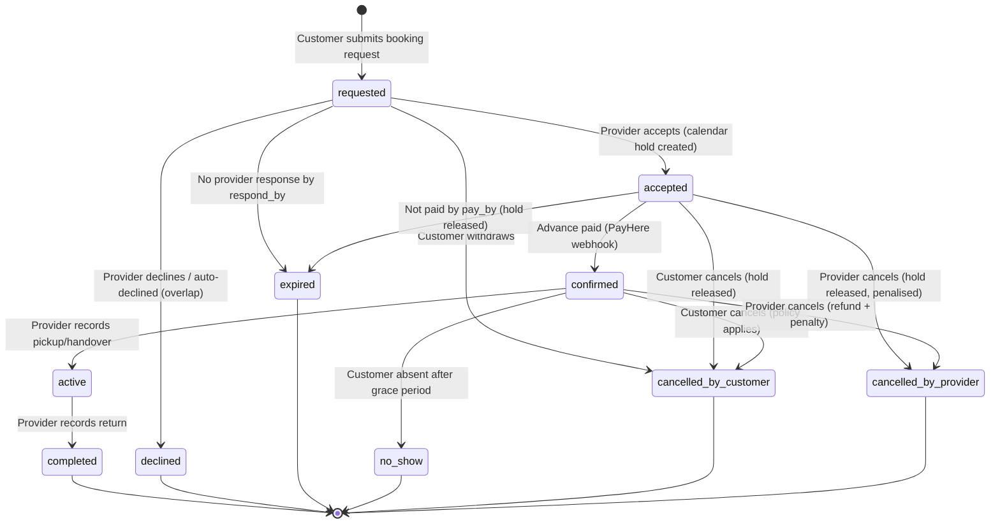
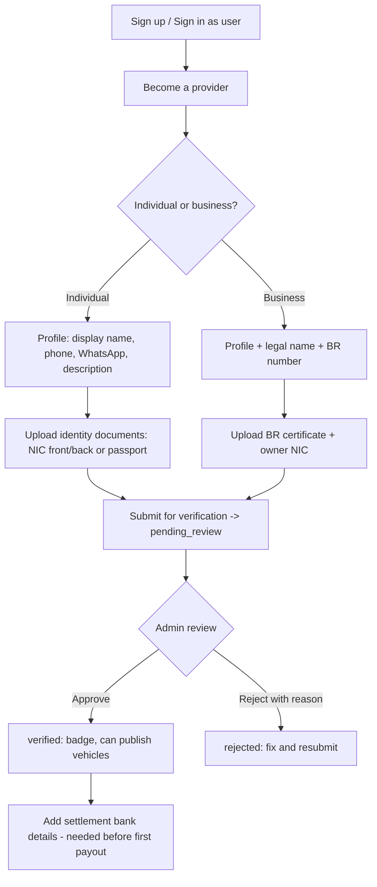

# User Flows

**Status:** Draft v0.1 for review (2026-10-02)
**Related:** [PRD.md](PRD.md), [DATABASE_DESIGN.md](DATABASE_DESIGN.md) §7 (booking lifecycle), [API_DESIGN.md](API_DESIGN.md)

Conventions: each flow lists the steps, the system behaviour at each step, the notifications fired, and the edge cases. Screens are named in `Title Case`; API endpoints are referenced by name only (details in API_DESIGN.md). "MVP" marks what ships in the first release; "Later" marks designed-for-but-deferred behaviour.

---

## 0. Booking lifecycle (shared by all flows)



Why this shape (and not the example list in the brief):

| Example state                      | Our treatment                                   | Reason                                                                                       |
| ---------------------------------- | ----------------------------------------------- | -------------------------------------------------------------------------------------------- |
| SEARCH                             | Not a booking state                             | Nothing exists in the DB yet                                                                 |
| BOOKING_REQUEST / PENDING_PROVIDER | Merged into `requested`                         | They describe the same waiting condition                                                     |
| CONFIRMED → PAYMENT_PENDING → PAID | `accepted` (awaiting payment) → `confirmed`     | A booking is only "confirmed" once money is in; naming it earlier misleads customers         |
| PICKUP / RETURN_PENDING            | Timestamps on `active`                          | They are moments, not waiting states with their own rules                                    |
| ACTIVE_RENTAL                      | `active`                                        |                                                                                              |
| DISPUTED                           | Overlay (`disputes` table + flag), not a state  | A dispute can exist on `completed`, `no_show` or `cancelled` bookings without rewinding them |
| REJECTED                           | `declined`                                      | Provider vocabulary                                                                          |
| EXPIRED                            | `expired` from either `requested` or `accepted` | Two timers: provider response, customer payment                                              |

Timers (platform settings): provider response window (default 24 h, shorter when pickup is near), payment window (default 24 h, capped at pickup time), no-show grace (default 3 h after `starts_at`).

---

## 1. Customer flows

### 1.1 Discover → Search

| #   | Step           | System behaviour                                                                                                                                                        | Notes                                                                                                                           |
| --- | -------------- | ----------------------------------------------------------------------------------------------------------------------------------------------------------------------- | ------------------------------------------------------------------------------------------------------------------------------- |
| 1   | Land on `Home` | Hero search box: _Where_ (place suggest or "Use my location"), _Pickup date/time_, _Return date/time_, _Category chips_. Popular launch towns shown as quick picks.     | SEO landing pages per town/category (`/rent/mirissa/scooters`) are generated from the same search.                              |
| 2   | Enter location | Typing queries the curated `places` gazetteer (no external API in MVP). "Use my location" calls browser geolocation; if denied, fall back to the place box with a hint. | Tourists outside Sri Lanka searching from abroad: geolocation is ignored if outside the island; show launch-region suggestions. |
| 3   | Pick dates     | Date-time pickers default to tomorrow 09:00 → +3 days 09:00, `Asia/Colombo`. Min duration 1 day; validation against vehicle `min_rental_days` happens per result.       | Dates are mandatory: without dates the platform cannot promise availability, which is the core value.                           |
| 4   | Submit         | Navigate to `Search Results` with query params in the URL (shareable).                                                                                                  |                                                                                                                                 |

**As implemented in Phase 5 (2026-10-04):** the home page carries the search box (place from the gazetteer, optional pickup/return days, vehicle type) and quick links to the launch towns; it navigates to `/search?placeId=…&startDate=…&endDate=…&categoryId=…`. Dates are optional in this phase (without them the list shows all discoverable vehicles and no availability promise); "use my location" and place type-ahead are deferred (`GET /places/suggest` exists for the next iteration).

### 1.2 Search Results → Filter → Compare

| #   | Step              | System behaviour                                                                                                                                                                                                                                                                                                                                                                                             |
| --- | ----------------- | ------------------------------------------------------------------------------------------------------------------------------------------------------------------------------------------------------------------------------------------------------------------------------------------------------------------------------------------------------------------------------------------------------------ |
| 5   | Results load      | `Search vehicles` returns only vehicles **free for the whole window** within the radius (default 15 km from the place centre or the user's point). Each card: primary photo, make/model/year, category, transmission, seats, distance, provider name + verification badge, rating, **total price for the requested period**, per-day equivalent, deposit, "Self-drive / With driver", pickup/delivery icons. |
| 6   | Toggle List / Map | Map (MapLibre) shows pins at provider location (not exact vehicle position); clicking a pin highlights the card. Moving the map offers "Search this area".                                                                                                                                                                                                                                                   |
| 7   | Filter            | Category, price range (per day), transmission, fuel, seats, rental mode (self-drive / with driver), delivery available, verified only (default on), instant book (later). Filters re-query the server.                                                                                                                                                                                                       |
| 8   | Sort              | Recommended (distance × rating), Price low→high, Price high→low, Distance, Rating.                                                                                                                                                                                                                                                                                                                           |
| 9   | Compare           | MVP: side-by-side comparison is implicit via consistent cards. Later: pin up to 3 vehicles into a `Compare` drawer.                                                                                                                                                                                                                                                                                          |

Empty state: "No vehicles available in Mirissa for these dates" with suggestions (widen radius to 30 km, shift dates ±1 day, other categories) and a "Notify me / Tell providers about demand" capture (stores a `search_log` row — Later).

**As implemented in Phase 5 (2026-10-04):** `/search` lists only discoverable vehicles (approved, active provider and location, ≥ 3 photos) and, with dates, only those free for the whole window and within the listing's min/max days. Cards show the primary photo, title, make/model/year, category, transmission, fuel, seats, AC, town and distance from the searched place, provider name with the "Platform-approved provider" badge, delivery, daily rate, deposit, included km, minimum days and the **estimated** total for the dates. Filters: vehicle type, transmission, fuel, minimum seats, daily price range, AC, delivery. Sorts: recommended (distance, then price), distance, price low→high, price high→low. "Show map" adds a MapLibre map with pins at the **approximate** area; it is optional and the list never depends on it. Pagination is "Show more" (cursor). Empty state suggests another town, dates or fewer filters; demand capture is deferred.

### 1.3 View Vehicle

`Vehicle Details` page shows:

- Photo gallery, title, category, specs (transmission, fuel, seats, engine cc, features)
- **Price panel** for the selected dates: line items (base × days, weekly/monthly rate if applied, driver fee, delivery fee), total, **pay now** (advance), **pay at pickup** (balance), **refundable deposit**, included km and extra-km rate, fuel policy
- Availability calendar (next 90 days; unavailable days greyed from `vehicle_holds`)
- Provider card: display name, verification badge(s), member since, completed rentals count, rating, response time, cancellation policy summary; **no phone number before confirmation**
- Pickup location: town/area and approximate map circle (exact pin only after confirmation), delivery options and fee
- Requirements: minimum age, licence requirements (tourists: IDP endorsement / temporary permit notice), what to bring at pickup
- Reviews (paginated)
- Call to action: **Request to book** (MVP) / **Book instantly** (Later)

Changing dates here re-runs the quote; if the vehicle is unavailable for the new dates the CTA is replaced by "Not available — see similar vehicles".

**As implemented in Phase 5 (2026-10-04):** `/vehicles/[slug]` is server-rendered (title/description metadata, canonical URL, Open Graph image) with a photo gallery, specifications, description, pricing and rental rules, the approximate pickup area on a map, the provider summary (display name, platform-approved badge, town, approved since, listings count, description — **no phone number**) and a date panel that checks real availability and shows the estimated total with the explicit note that it is not a booking quote. The call to action is "Request booking — coming next" (disabled); no booking, payment or quote token exists yet. Reviews, the 90-day calendar and licensing notices arrive with later phases.

### 1.4 Booking request

```mermaid
sequenceDiagram
    actor C as Customer
    participant W as Web app
    participant A as API
    participant DB as PostgreSQL
    participant N as Notifications
    actor P as Provider

    C->>W: Request to book (dates, mode, pickup type)
    W->>A: GET quote
    A->>DB: price calc + availability check
    A-->>W: quote (frozen breakdown)
    W->>C: Review & confirm (driver details, note, terms)
    C->>W: Submit
    W->>A: POST bookings (Idempotency-Key)
    A->>DB: insert booking(status=requested), booking_drivers, booking_events
    A->>N: enqueue booking.requested (provider: in-app+SMS+email; customer: in-app+email)
    A-->>W: 201 booking (ref, respond_by)
    W->>C: Request sent screen
    N-->>P: "New request SLR-7F3K2Q, respond within 24h"
```

Steps and rules:

1. If not logged in, an inline sign-in/sign-up is shown (email or phone OTP). Verified phone **or** verified email is required to submit a request.
2. `Review & Confirm` collects: rental mode, pickup type (at location / delivery address), driver details (self-drive only: full name, licence number, licence country, expiry, ID type and number; tourists see the IDP/temporary-permit notice), optional note, acceptance of cancellation policy and terms.
3. The frozen quote is re-validated server side (price and availability). If anything changed: `409 QUOTE_CHANGED` and the page refreshes the price.
4. The request does **not** block the vehicle (see DATABASE_DESIGN §7). The customer is told: "The provider has until _{respond_by}_ to accept. You pay only after acceptance."
5. Customer can withdraw while `requested` (no fee).

**As implemented in Phase 6 (2026-10-04):** on `/vehicles/[slug]` the customer picks dates, sees the real price and availability (`GET /vehicles/{slug}/quote`) and presses **Request to book** → `/bookings/new?vehicle=…&startDate=…&endDate=…` (anonymous visitors go through login and return with the dates kept). The form collects the driver's name, licence country and expiry (optional country of residence) and a message to the provider; **no licence or ID numbers, no documents, no terms re-acceptance** (accepted at registration). Submission sends `POST /bookings` with a client-generated `Idempotency-Key` and the signed quote token; a changed or expired price is refreshed in place (`409 QUOTE_CHANGED` / `QUOTE_EXPIRED`). The request **does not reserve the vehicle**; the page says "The provider has until _{respondBy}_ to accept" and both parties receive an e-mail. Phone/OTP sign-in, inline sign-up, saved driver details, rental mode, pickup type / delivery and the policy checkbox are deferred.

### 1.5 Provider response → Payment

| State                   | Customer sees                                                                                                                                                                                             | Notifications                                                                             |
| ----------------------- | --------------------------------------------------------------------------------------------------------------------------------------------------------------------------------------------------------- | ----------------------------------------------------------------------------------------- |
| `accepted`              | "Accepted! Pay the LKR 5,150 booking advance by _{pay_by}_ to confirm. The remaining LKR 46,350 and the LKR 25,000 refundable deposit are paid to the provider at pickup." Pay button → PayHere Checkout. | in-app + email + SMS (`booking.accepted`), reminder at T-6 h (`booking.payment_reminder`) |
| `declined`              | Reason (if given) + similar available vehicles.                                                                                                                                                           | `booking.declined`                                                                        |
| `expired` (no response) | Apology + similar vehicles; the provider's acceptance-rate metric is reduced.                                                                                                                             | `booking.expired`                                                                         |

Payment flow (MVP = online advance via PayHere Checkout):

1. `Create checkout` returns the PayHere form parameters (merchant id, order id, amount, currency, hash). The browser posts to PayHere.
2. Customer pays by card / Genie / eZ Cash / bank app (whatever PayHere enables for the merchant).
3. PayHere calls `notify_url` server-to-server; the API verifies the `md5sig`, writes `payment_webhook_events`, marks the payment `paid`, transitions the booking `accepted → confirmed`, writes ledger entries (advance collected, commission), and notifies both parties.
4. The browser returns to `Booking Confirmed` via `return_url`; the page polls booking status until the webhook has landed (max 60 s, then "we'll email you").
5. Failure / cancel: `payment.status = failed`; the booking stays `accepted` until `pay_by`; customer can retry.

Confirmation screen contents: booking ref, vehicle, dates, **exact pickup address + map pin + instructions**, provider phone and WhatsApp deep link, what to bring (licence, ID, deposit amount and accepted deposit methods), balance due at pickup, cancellation policy, "Add to calendar".

### 1.6 Pickup → Rental → Return

| #   | Step          | System behaviour                                                                                                                                                                                                                                     |
| --- | ------------- | ---------------------------------------------------------------------------------------------------------------------------------------------------------------------------------------------------------------------------------------------------- |
| 1   | Reminder      | T-24 h: `booking.pickup_reminder` (in-app + email + SMS) with address and balance due.                                                                                                                                                               |
| 2   | Handover      | Provider verifies licence/ID physically, collects balance + deposit, records odometer/fuel/deposit in the app → `active`. Customer gets `booking.started` with the recorded values (their protection against disputes).                              |
| 3   | During rental | Customer `Booking Details` shows return time, provider contact, "Need help?" (contact provider; report a problem → dispute; platform support email). Extension request: Later (requires availability check and new payment).                         |
| 4   | Return        | Provider records return odometer/fuel, extra charges (extra km, fuel, damage with photos — Later structured, MVP free text + amount), deposit returned amount → `completed`. Customer gets `booking.completed` with the summary and a review prompt. |
| 5   | No-show       | If the customer is absent 3 h after `starts_at` and uncontactable, provider marks `no_show`; advance is retained per policy; customer notified and can dispute.                                                                                      |

### 1.7 Cancellation

- While `requested`: withdraw, no charge.
- While `accepted` (unpaid): cancel, no charge, hold released.
- While `confirmed`: platform-wide policy in MVP (one rule for all vehicles): full advance refund if cancelled ≥ 48 h before pickup; otherwise advance forfeited. Refund executed by admin via PayHere (manual in MVP) and recorded as a `refund` payment + ledger entry. Later: provider-selectable policies (flexible / moderate / strict).
- Provider cancellation of a `confirmed` booking: customer refunded in full, provider receives a cancellation strike (visible in admin, affects ranking), customer notified with alternatives.

**As implemented in Phase 6 (2026-10-04, §1.5–§1.7):** `/bookings` lists the customer's bookings (current / past), `/bookings/[id]` shows status wording per state, the price snapshot, pickup area (exact address and instructions only once confirmed), provider card, driver details, handover records and the timeline. **Accepted** shows a disabled "Pay to confirm — coming next" button and explains that the platform confirms bookings manually in this release; the temporary admin action `confirm-for-testing` replaces payment until Phase 7 (`accepted → confirmed`, both parties e-mailed, the customer e-mail carries the pickup address). From `confirmed` the customer can reveal the provider's phone / e-mail / WhatsApp link (`GET /bookings/{id}/contact`). **Timers:** `respond_by = min(now + 24 h, pickup)`; an `accepted` booking not confirmed within `payment_window_hours` (24 h, capped at pickup) expires and the vehicle is released (both parties e-mailed). **Cancellation:** the customer may cancel while `requested`, `accepted` or `confirmed` with no fee and no refund logic (nothing was paid); the provider may cancel `accepted` or `confirmed` bookings; the hold is deleted in the same transaction and the other party is e-mailed. **No-show** is recorded by the provider from `confirmed` once 3 h after pickup have passed, with a contact-attempt note; it releases the hold. Payment, refunds, cancellation fees / strikes, payment reminders, `T-24 h` pickup reminders, extra charges at return, extension and disputes are deferred.

### 1.8 Review

- Available for `completed` and `no_show` (customer side only for completed) bookings from `completed_at` until +14 days.
- One review per booking: overall rating (1–5), optional sub-ratings, comment. Published immediately; moderated reactively by admin (hide + reason).
- Provider may reply once. Aggregates update on vehicle and provider.

---

## 2. Provider flows

### 2.1 Register → Verify



Rules:

- Verified **phone** is mandatory for providers (bookings are time-critical; SMS is the reliable channel in Sri Lanka).
- Providers can add locations and draft vehicles while `pending_review`, but vehicles cannot go `active` until the provider is `verified`.
- Admin SLA target: 1 business day (operational, not system-enforced in MVP).

**As implemented in Phase 3 (2026-10-03):** `/become-a-provider` (public explainer) → `/provider/application` (form: business name and type, contact person, phone — collected, **not verified** — WhatsApp, district and primary town from the gazetteer, extra service areas, address, description, vehicle types, optional years / fleet size / website / notes) → **Save draft** or **Submit** (requires accepting the provider agreement). A status banner shows `Draft`, `Submitted`, `Under review`, `Changes requested` (with the reviewer's message; the form reopens for correction and resubmission), `Approved` or `Not approved`. **No documents are uploaded**: the operator verifies the business manually (calls the number, checks address / website) and records the decision in the admin UI. Approval e-mails the provider and unlocks `/provider/dashboard` (profile summary, "Platform-approved provider" badge, "vehicle listings come next"). Phone verification, document upload and bank details follow in later phases.

### 2.2 Add Location

`Locations` → `New location`: name, address, choose nearest town/area from the gazetteer (only active districts offered), drop/drag a pin on the map (MapLibre; initial pin at the town centre; optional "use my current location"), pickup instructions, delivery toggle + radius + flat fee. First location becomes primary.

**As implemented in Phase 4 (2026-10-03):** `/provider/locations` lists locations (primary / inactive badges, vehicle count) with an inline editor: name, district and town from the gazetteer, address, optional latitude/longitude typed in (no map), pickup instructions, "make primary". The first location becomes primary automatically; **Deactivate** is refused while vehicles use the location and can be undone with **Reactivate**. Delivery is configured per vehicle (flag + flat fee) in this phase.

### 2.3 Add Vehicle

Wizard (saved as `draft` at each step):

1. **Basics**: category, make, model, year, registration number, transmission, fuel, seats, engine cc (bikes/tuk-tuks), colour, features, description.
2. **Photos**: 3–15 photos via direct-to-storage presigned upload; drag to reorder; first is primary. Server generates variants asynchronously.
3. **Pricing**: currency (LKR), daily rate, optional weekly/monthly rate, rental mode offer (self-drive / with driver / both), driver fee per day, security deposit, included km/day (or unlimited), extra-km rate, min/max days, turnaround buffer, advance notice.
4. **Location & delivery**: home location (from provider's locations), delivery inherits the location's settings.
5. **Documents**: Certificate of Registration, revenue licence (expiry date), insurance certificate (expiry date). Required for the "Verified vehicle" badge; the product decision in PRD.md says whether they are required before going active.
6. **Review & publish** → `pending_review` (if document verification is required) or `active` (if provider is verified and documents are optional).

**As implemented in Phase 4 (2026-10-03):** `/provider/vehicles/new` creates a `draft` from category, make, model and year; `/provider/vehicles/[id]` is a single form (basics, category-aware specifications, pricing in LKR, rules & pickup) with **Save** and **Save and submit for review**. The page shows the submission checklist, the reviewer's message after `changes_requested`, and locks identity fields once approved. Photos (step 2) and documents (step 5) are deferred; submission moves the listing to `submitted` for manual platform review.

### 2.4 Configure Availability

`Calendar` per vehicle: month view from `vehicle_holds` (bookings in blue with ref; blocks in grey). Provider can add a block (date range + reason) or remove their own block. Attempting to block over a confirmed booking is refused with the conflicting booking shown. Later: iCal import/export to sync with other channels.

**As implemented in Phase 4 (2026-10-03):** `/provider/vehicles/[id]/availability` (approved or inactive listings) shows an eight-week day strip with blocked days shaded, the list of current and upcoming blocks, a "block dates" form (inclusive date range in Sri Lanka time, reason, internal note) and a "check a window" tool that answers exactly what the availability API will tell customers later. Overlapping blocks are refused with the conflicting period; bookings do not exist yet.

### 2.5 Receive Booking → Accept/Decline

| #   | Step                     | System behaviour                                                                                                                                                                                                                                                                                                                            |
| --- | ------------------------ | ------------------------------------------------------------------------------------------------------------------------------------------------------------------------------------------------------------------------------------------------------------------------------------------------------------------------------------------- |
| 1   | Notification             | `booking.requested`: in-app, SMS ("New request SLR-7F3K2Q: Toyota Aqua, 12–17 Nov, LKR 51,500. Respond by 13 Nov 10:00"), email with details.                                                                                                                                                                                               |
| 2   | `Booking Request` screen | Customer first name, verified badges (phone/email), member since, completed rentals, dates, mode, pickup type/address, price breakdown and **what the provider will receive** (total − commission), driver licence summary (number masked until confirmed; country and expiry visible), customer note, overlapping-requests warning if any. |
| 3   | Accept                   | Transactional hold creation (DATABASE_DESIGN §7.3). On conflict (vehicle blocked meanwhile) the provider sees "This vehicle is no longer free for these dates". Other overlapping requests are auto-declined. Customer notified to pay.                                                                                                     |
| 4   | Decline                  | Optional reason (vehicle unavailable, customer requirements not met, other). Customer notified.                                                                                                                                                                                                                                             |
| 5   | Timeout                  | `expired` at `respond_by`; provider's acceptance rate decreases; admin can see providers with low response rates.                                                                                                                                                                                                                           |
| 6   | Awaiting payment         | Hold visible on calendar as "awaiting payment"; if the customer does not pay by `pay_by`, hold released and provider notified (`booking.payment_expired`).                                                                                                                                                                                  |

### 2.6 Handover → Complete Rental

- `Confirmed` bookings appear in `Upcoming` with customer contact (phone/WhatsApp revealed at confirmation) and full driver details for licence check at pickup.
- **Record pickup**: odometer, fuel level, deposit collected (amount + method), balance collected (amount + method), optional note → `active`. Both parties receive the record.
- **Record return**: odometer, fuel level, extra charges (list with amounts; MVP free text per line), deposit returned amount, note → `completed`. Customer receives summary + review prompt.
- **No-show**: after grace period, provider can mark no-show (requires a contact attempt note).
- **Earnings**: `Earnings` shows per-booking ledger (advance collected by platform, commission, net owed), pending settlement, paid settlements with references.

**As implemented in Phase 6 (2026-10-04, §2.5–§2.6):** `/provider/bookings` is the inbox (tabs: Requests, Reserved and confirmed, Past, All); `/provider/bookings/[id]` shows the customer's first name, member-since month and e-mail-verified flag, the driver snapshot (name, licence country, expiry — no licence number), dates, the price snapshot (the rental total; no commission is deducted in this release) and the customer's note. **Accept** (optional message to the customer) runs the transactional hold creation; on a conflict the provider sees "no longer free for these dates"; other overlapping requests are auto-declined and their customers e-mailed. **Decline** needs one of `vehicle_unavailable | requirements_not_met | schedule_conflict | other` (note required for `other`). Overdue requests expire automatically (every minute) and a late accept returns `410`. Once **confirmed** (admin testing action until Phase 7) the provider can reveal the customer's contact details, **record the pickup** (odometer, fuel in eighths, note → `active`), **record the return** (same → `completed`; the hold stays as history), **mark a no-show** after the grace period, or **cancel** (hold released). Deposit / balance collection amounts, extra charges, calendar display of "awaiting payment" holds, acceptance-rate metrics and earnings are deferred.

---

## 3. Admin flows

Admin UI lives at `/admin` in the same web app, gated by `admin` / `super_admin` roles and a second factor (email OTP at login in MVP).

**As implemented in Phase 3 (2026-10-03):** `/admin/providers` (application queue with status filter, plus an "Approved providers" tab with suspend / reactivate) and `/admin/providers/applications/[id]` (detail with Start review / Request changes / Approve / Reject and reasons). Admins log in with the normal e-mail + password flow; the second factor is a production-hardening item. Admin accounts are created with `pnpm admin:grant --email <verified user>`.

### 3.1 Login

Email + password + email OTP. Sessions are shorter than customer sessions (8 h). All actions are written to `admin_audit_logs`.

### 3.2 Provider Verification

`Verification queue` → provider → view profile, documents (signed, short-lived URLs; views are logged), prior rejections → **Approve** (sets `verified`, notifies provider) / **Reject** with mandatory reason (notifies provider; documents remain for resubmission) / **Request more info** (sets back to `unverified` with a message). Suspend / unsuspend with reason.

_Phase 3 implementation:_ no documents exist; the reviewer sees the application (contact details, operating area, description, agreement acceptance), calls or e-mails the applicant to confirm, then **Start review** → **Approve** (creates the profile, grants `provider`, e-mails) / **Request changes** (reason shown and e-mailed; the applicant edits and resubmits) / **Reject** (terminal in Phase 3; reason e-mailed). **Suspend** / **Reactivate** act on the provider profile with a reason and an e-mail.

### 3.3 Vehicle Verification

`Vehicle queue` (pending_review) → check photos, documents (CR matches registration number and provider; revenue licence and insurance in date) → Approve (vehicle `active` + `verified`) / Reject with reason. Document expiry job flags vehicles whose insurance or revenue licence lapses: badge removed and provider notified 14 days before and on expiry; vehicle auto-paused on expiry (product setting).

_Phase 4 implementation:_ `/admin/vehicles` (queue with status filter) and `/admin/vehicles/[id]` (provider and owner, full specification, pricing and rules, pickup location, internal notes, outstanding checklist). No photos or documents exist; the reviewer confirms details with the provider, then **Start review** → **Approve** / **Request changes** (reason e-mailed; provider edits and resubmits) / **Reject** (terminal). **Suspend** removes an approved or inactive listing from availability until **Reactivate**. Every decision is audited and e-mailed.

### 3.4 Manage Users

Search by name/email/phone; view bookings; suspend/unsuspend (reason mandatory; sessions revoked); trigger password reset; process account-deletion requests (anonymisation).

### 3.5 Manage Listings

Search/filter vehicles; pause/unpause; edit category or fix obvious errors (logged); remove photos that violate policy; view a listing as a customer would.

### 3.6 Manage Bookings

Search by ref/customer/provider/vehicle; view timeline (`booking_events`), payments, ledger; cancel on behalf of a party with reason (refund decision recorded); resend notifications; manually record a payment (e.g. bank transfer fallback).

### 3.7 Disputes

Queue of open disputes: booking timeline, handover/return records, messages from both parties, attachments → decision (resolve with amount/notes; reject). Resolution may create ledger adjustments and a manual refund task. Both parties notified.

### 3.8 Settlements & Reports

`Settlements` → generate for a period → per-provider statement (collected, commission, refunds, payable) → approve → mark paid with bank reference (manual transfer in MVP). `Reports`: bookings by status/week, GMV, commission, conversion funnel (search → view → request → accepted → paid), top towns/categories, unmet demand (searches with zero results), provider response metrics, document-expiry list.

---

## 4. Cross-cutting notification matrix (MVP)

| Event                        | Customer | Provider    | Channels                       |
| ---------------------------- | -------- | ----------- | ------------------------------ |
| booking.requested            | ✓        | ✓           | in-app, email; SMS to provider |
| booking.accepted             | ✓        |             | in-app, email, SMS             |
| booking.payment_reminder     | ✓        |             | in-app, SMS                    |
| booking.declined / expired   | ✓        | ✓ (expired) | in-app, email                  |
| booking.confirmed            | ✓        | ✓           | in-app, email, SMS             |
| booking.pickup_reminder      | ✓        | ✓           | in-app, email, SMS             |
| booking.started / completed  | ✓        |             | in-app, email                  |
| booking.cancelled            | ✓        | ✓           | in-app, email, SMS             |
| review.requested             | ✓        |             | email                          |
| review.received              |          | ✓           | in-app, email                  |
| document.expiring / expired  |          | ✓           | in-app, email, SMS             |
| provider.verified / rejected |          | ✓           | in-app, email, SMS             |
| settlement.paid              |          | ✓           | email                          |

WhatsApp messaging via the Business Platform is **Later**; MVP uses `wa.me` click-to-chat links which require no API.
